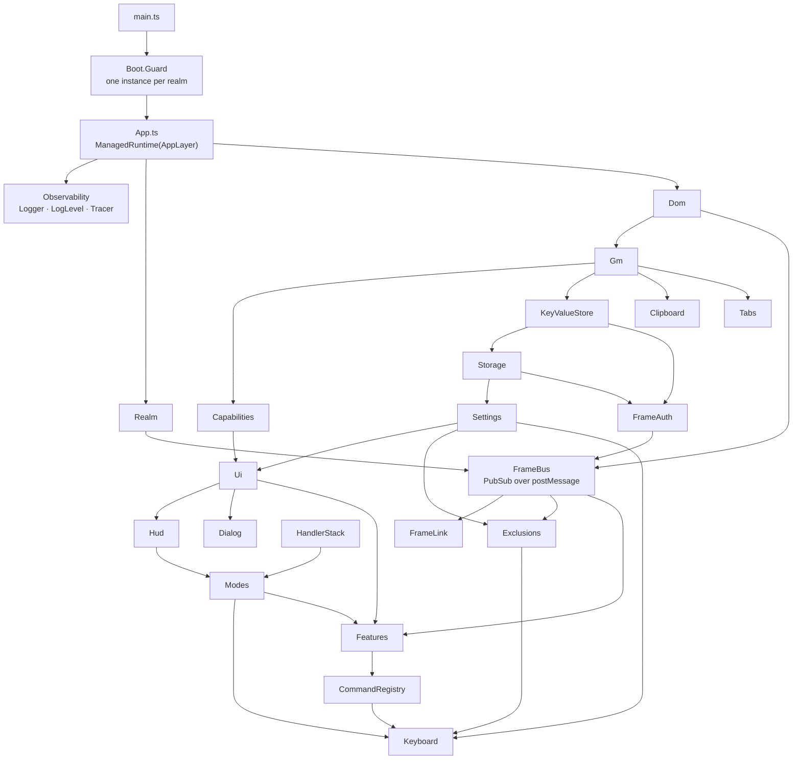

# Architecture

Vimium-WebKit is one Effect application. This document gives the rules. Read it
before you add a file.

The reference for the Effect idiom is
[LLMS.md](https://github.com/Effect-TS/effect/blob/main/LLMS.md).

## 1. The rules

1. **Every capability is a service.** A module that holds state, touches the
   DOM, or can fail is a `Context.Service` with a `static layer`.
2. **Every fallible operation returns an `Effect`.** The error channel names the
   failure. There is no `throw` and no rejected `Promise` in `src/`.
3. **Every error is a value.** Declare it with `Schema.TaggedErrorClass`. Handle
   it with `Effect.catchTag`, `Effect.catchTags` or `Effect.catchReason`.
4. **No `any`.** Untrusted input is `unknown`, and `Schema` decodes it.
5. **No `Promise` and no `async`.** A browser API that gives a promise is
   wrapped once, at the edge, with `Effect.tryPromise` or `Effect.callback`.
6. **State lives in a `Ref`.** Shared, observable state lives in a
   `SubscriptionRef`. There is no mutable module-level variable.
7. **Resources are scoped.** Acquire a listener, an observer, a stylesheet or a
   port with `Effect.acquireRelease` inside the layer that owns it. Teardown is
   the close of a scope, never a `dispose()` method that somebody must remember
   to call.
8. **Service methods use `Effect.fn("Service.method")`.** The name gives the
   stack trace and the span.
9. **Pure code stays pure.** Parsing, scoring, geometry and key notation are
   plain functions in `src/domain/`. They take data and return data.

## 2. The layer graph



### 2.1 The bus breaks every cycle

Three pairs of subsystems need each other:

- Hints needs remote frames, and a remote frame needs Hints to answer.
- Exclusions needs the top frame, and the top frame needs Exclusions to answer.
- The omnibar needs history from the top frame, and the top frame serves it.

None of them depends on the other. Each publishes a request on `FrameBus` and
subscribes to the requests that it can answer. `FrameBus` depends on nothing
above the platform, so the graph stays a tree.

### 2.2 Features never depend on each other

A feature registers its commands in `CommandRegistry` when its layer is built.
`Keyboard` reads the registry. A feature therefore never imports another
feature, and `Keyboard` never imports a feature. A feature that needs what
another feature does asks the registry by name, with `Commands.run`.

The split has one cost: a command can exist in the catalogue with no body, and
answer "unavailable" to the user. The `command-bodies` invariant in
`build/invariants.ts` refuses that, for every tier A and tier B command.

## 3. The keyboard path is synchronous

`preventDefault()` works only during synchronous dispatch. Safari has no
`setImmediate`, so a fiber yield becomes a `setTimeout` macrotask, and the page
has already scrolled by the time the decision arrives.

This is a correctness limit, not a performance preference.

> **Rule.** An effect that a `keydown` listener can reach must not suspend. Use
> `Effect.sync`, `Effect.succeed`, `Effect.fail`, `Ref` operations and service
> reads. Do not use `Effect.async`, `Effect.promise`, `Effect.tryPromise` or
> `Effect.sleep`.

`ManagedRuntime.runSyncExit` is the documented bridge into imperative callers.
It is total: a defect becomes an `Exit`, not a throw inside a DOM listener.

Slow work leaves the path with `Effect.forkDetach` or `runtime.runFork`.

`build/invariants.ts` checks the rule against the modules that the key path
reaches.

## 4. State

| State                 | Holder                 | Type                                               |
| --------------------- | ---------------------- | -------------------------------------------------- |
| Settings              | `core/Settings.ts`     | `SubscriptionRef<Settings>`                        |
| Compiled key trie     | `core/Mappings.ts`     | `SubscriptionRef`, rebuilt from `Settings.changes` |
| Half-typed keys       | `core/Keyboard.ts`     | `SubscriptionRef<string \| null>`                  |
| Messages for the user | `core/Report.ts`       | an unbounded `Queue`                               |
| Handler stack         | `core/HandlerStack.ts` | `Ref<readonly Entry[]>`                            |
| Mode stack            | `core/Modes.ts`        | `Ref<readonly Frame[]>`                            |
| Exclusion verdict     | `core/Exclusions.ts`   | `SubscriptionRef`                                  |
| Persisted groups      | `platform/Storage.ts`  | one fiber per group                                |
| Per-feature state     | the feature service    | `Ref`                                              |

A service that derives state from another service subscribes to its `changes`
stream in a forked fiber. The fiber belongs to the layer scope, so it stops when
the runtime is disposed.

## 5. Storage is a serial actor

The old store used epochs, a semaphore and an in-flight counter to order reads,
writes, resets and debounced flushes. Order is not a property that those
primitives give.

Each group now owns one fiber and one `Queue` of commands. The fiber runs one
command to completion before it takes the next. Order is the order of the queue.
A caller waits on a `Deferred` that the fiber completes.

This removes the epoch, the committed counter, the outstanding counter and the
lock.

### 5.1 A page-readable store gives no cross-frame session

`frames/Auth.ts` keeps the credential of the session in the value store of the
userscript manager, and nowhere else. A manager that gives no value store leaves
the application on the in-memory backend. `KeyValueStore.managerPrivate` is then
`false`, every operation of `FrameAuth` fails with `unavailable`, and no frame
joins the session. Link hints across frames, frame focus and the exclusion
verdict of a child frame all stop. `platform/Capabilities.ts` warns the user
about each of those losses, because a loss of function with no message is worse
than the loss itself.

The top frame does **not** give a credential of its own to a child during the
handshake. That would restore the session, and it would also give the session to
the page. The reasons are these:

- A userscript shares its realm with the page. The page reads every `message`
  event that a window of the page receives, and it holds a copy of every
  `MessagePort` that a `JOIN` transfers. A credential on either route is public
  at the moment it travels.
- A key agreement over the port does not repair that. The page is an active
  party, and not a silent listener: it runs in the realm of the top frame, it
  can answer as the other end of the port, and it can put a frame of its own in
  the frames tree. An unauthenticated agreement gives it the key of a link.
- A same-origin child cannot be reached around the page either. Page script
  reads any value that we plant in such a child, and a cross-origin child cannot
  be reached that way at all.

Admission therefore needs one value that the page cannot read, and the manager
is the only holder of such a value. With no manager store the frames of the page
stay apart. That is the safe result, because a page that can join the session
can drive a click inside a document of another origin.

The credential also has a group of its own in the value store. `frames/Auth.ts`
builds that group, and it keeps it in a closure. `Storage` neither builds it nor
exposes it, so no group that a feature can read holds a field for the
credential. A feature has no name for the value, and the module that owns it
gives no method that returns it. One path goes around the fiber, and it exists
for one moment: the page exit. `flushUnsafe` writes the held value with a direct
call to the backend. The Effect scheduler is a macrotask in a page, so a value
that waits for the fiber is lost when the document goes away. Section 7 says
where that path is used.

## 6. Errors

Every error is a `Schema.TaggedErrorClass`. A `reason` field is used when the
callers treat the variants the same way, and a separate class is used when they
do not.

| Error            | Raised by               | Reasons                                                            |
| ---------------- | ----------------------- | ------------------------------------------------------------------ |
| `GmError`        | `platform/Gm.ts`        | `unavailable` · `failed` · `invalid`                               |
| `StorageError`   | `platform/Storage.ts`   | `backend` · `malformed` · `invalid` · `migration` · `cancelled`    |
| `ClipboardError` | `platform/Clipboard.ts` | `unavailable` · `denied` · `failed`                                |
| `TabError`       | `platform/Tabs.ts`      | `unavailable` · `blocked` · `failed` · `unsafe-url`                |
| `FrameError`     | `frames/Bus.ts`         | `timeout` · `unauthenticated` · `malformed` · `no-peer` · `failed` |
| `FrameAuthError` | `frames/Auth.ts`        | `unavailable` · `unauthenticated` · `failed`                       |
| `UiError`        | `ui/Ui.ts`              | `unavailable`                                                      |
| `CommandError`   | `core/Commands.ts`      | `unknown` · `unavailable` · `failed`                               |
| `DomError`       | `platform/Dom.ts`       | `missing` · `denied`                                               |

A failure that the user must see becomes a HUD line. `core/Report.ts` holds that
one rule, so no service decides for itself how to speak to the user.

## 7. Starting, and stopping

`src/main.ts` runs in every frame of every page. It does four things:

1. It claims the realm, so that a second injection does nothing.
2. It waits until something says that the user wants us: a key that is not for a
   text field, a wake message from an ancestor, or 1200 ms in the top frame.
3. It builds `AppLayer`, and gives the application the keyboard.
4. It releases the runtime when this frame's page goes away for good.

Step 2 keeps a page with twenty frames cheap. A frame that never receives a key
builds the guard only. The guard runtime holds `Dom` and `Realm`, and nothing
else.

Two messages travel between frames before the handshake, and the difference
matters:

- **wake** starts a frame that has not started. Only an ancestor may send it,
  and only a hint round does.
- **announce** asks a frame that is _already_ running to say so again. The
  coordinator sweeps with this when it starts, because a frame that started
  before its listener existed hears nothing. The guard ignores it.

`src/boot/Bootstrap.ts` is the composition root. It is a `Layer.effectDiscard`,
so each step that it takes belongs to the layer scope. It is the only file that
may read a feature and the core in the same breath.

Stopping is the close of the runtime scope. No service has a `stop` method, and
no module keeps a list of things to remove.

The page decides when the scope closes, and `src/boot/Lifecycle.ts` reads that
decision:

- A hook that `Lifecycle.onExit` registers starts **inside** the browser's own
  dispatch. A subscriber of the event bus does not, because it reads the bus on
  another fiber, and the page can be gone by then. The exit hook therefore does
  the work that a dying page must not lose: it writes every held value to the
  backend with a direct call. The call is `GM_setValue` or
  `localStorage.setItem`, and it takes no scheduler turn. A flush through the
  storage actor follows it, and that flush completes only when the page lives
  on.
- `pagehide` with `persisted === true` is not a final exit. The page may come
  back from the back/forward cache, and a restored page never runs its scripts
  again. Nothing is released there.
- `visibilitychange` to `hidden` runs the same hooks, and it is never final. It
  is the last moment that mobile WebKit reliably gives us. `unload` is never
  used.
- A final exit releases the runtime. `src/main.ts` owns that runtime, so it
  gives the `RuntimeOwner` service that `src/boot/Bootstrap.ts` asks for. The
  release runs after the last writes reached storage, because it closes the
  scope that the storage actor lives in. Each frame releases only its own
  runtime.

## 8. Directory layout

```
src/
  main.ts             entry point; realm guard, then the runtime
  App.ts              AppLayer and the runtime for one frame

  domain/             pure data and schemas; no services, no DOM
  platform/           the browser and the userscript manager
  core/               settings, keys, modes, commands, exclusions
  ui/                 the shadow root, the HUD and the dialogs
  frames/             the cross-frame bus and its protocol
  features/           hints, find, visual, marks, insert, omnibar, scroller,
                      navigation, tabs, clipboard
  boot/               the injection guard, the lifecycle and the key bridge
```

A file in `domain/` must not import from any other directory. A file in
`platform/` must not import from `core/`, `ui/`, `frames/` or `features/`. A
feature must not import another feature.

## 9. Testing

Unit tests use `@effect/vitest` and `it.effect`. A test provides a stub layer
instead of a global. There is no `globalThis` patching in a unit test.

End-to-end tests keep Playwright. They test the artefact, not the modules.
