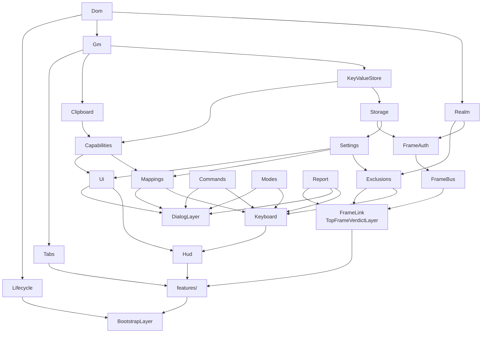

# Architecture

Vimium-WebKit is one Effect application. This document gives the rules. Read it
before you add a file.

The reference for the Effect idiom is
[LLMS.md](https://github.com/Effect-TS/effect/blob/main/LLMS.md).

## 1. The rules

1. **Every capability is a layer.** A module that other modules call, and that
   holds state, touches the DOM or can fail, is a `Context.Service` with a
   `static layer`. A feature that only registers commands and answers frame
   messages provides no service. It is a `Layer.effectDiscard`, as
   `BootstrapLayer` is. `HintsLayer`, `FindLayer`, `VisualLayer`,
   `MarksLayer`, `TabControlLayer`, `UrlClipboardLayer` and `DialogLayer`
   are layers of that kind.
2. **Every fallible operation returns an `Effect`.** Pure code returns a
   `Result` instead. The error channel names the failure. There is no `throw`
   and no rejected `Promise` in `src/`.
3. **Every error is a value.** Declare it with `Schema.TaggedError`. Handle it
   with `Effect.catchTag` or `Effect.catchTags`.
4. **No `any`.** Untrusted input is `unknown`, and `Schema` decodes it.
5. **A promise stays at the edge.** A browser or manager API that gives a
   promise is wrapped where it is called, with `Effect.tryPromise` or
   `Effect.callback`. No other code makes or awaits a promise. The one `async`
   function, in `platform/Gm.ts`, turns a manager call that gives either a
   value or a promise into a promise for `Effect.tryPromise`.
6. **State lives in a `Ref`.** Shared, observable state lives in a
   `SubscriptionRef`. There is no mutable module-level variable. A storage
   group keeps the value that the page exit writes in a `MutableRef`, because
   that path runs with no effect.
7. **Resources are scoped.** Acquire a listener, an observer, a stylesheet or a
   port with `Effect.acquireRelease` inside the layer that owns it. Teardown is
   the close of a scope, never a `dispose()` method that somebody must remember
   to call.
8. **A traced workflow uses `Effect.fn("Service.method")`.** The name gives
   the stack trace and the span. An internal helper uses `Effect.fnUntraced`.
9. **Pure code stays pure.** Parsing, scoring, key notation and the rules of a
   hint round are plain functions in `src/domain/`. They take data and return
   data.

## 2. The layer graph

Each arrow points from a module to a module that imports it. An arrow that a
longer path already gives is left out. The graph also leaves out `domain/`,
type-only imports, and the helper modules, such as `platform/Elements.ts` and
`core/HandlerStack.ts`. `App.ts` imports every layer to build `AppLayer`, and
`main.ts` joins it to `BootstrapLayer` and the guard, so neither file is drawn.


```mermaid
flowchart TD
  Dom --> Realm
  Dom --> Gm
  Dom --> Lifecycle
  Gm --> KeyValueStore
  Gm --> Clipboard
  Gm --> Tabs
  KeyValueStore --> Storage
  KeyValueStore --> Capabilities
  Clipboard --> Capabilities

  Storage --> Settings
  Storage --> FrameAuth
  Realm --> FrameAuth
  FrameAuth --> FrameBus

  Realm --> Exclusions
  Settings --> Exclusions
  Settings --> Mappings
  Capabilities --> Mappings
  Settings --> Ui
  Capabilities --> Ui

  Commands --> Keyboard
  Exclusions --> Keyboard
  Mappings --> Keyboard
  Modes --> Keyboard
  Report --> Keyboard

  Keyboard --> Hud
  Ui --> Hud
  Commands --> Dialog["DialogLayer"]
  Mappings --> Dialog
  Modes --> Dialog
  Report --> Dialog
  Ui --> Dialog

  Exclusions --> Link["FrameLink<br/>TopFrameVerdictLayer"]
  FrameBus --> Link
  Report --> Link

  Link --> Features["features/"]
  Hud --> Features
  Tabs --> Features
  Features --> Bootstrap["BootstrapLayer"]
  Lifecycle --> Bootstrap
```

### 2.1 The bus breaks every cycle

Two pairs of subsystems need each other:

- Hints needs remote frames, and a remote frame needs Hints to answer.
- Exclusions needs the top frame, and the top frame needs Exclusions to answer.

Neither side imports the other. Each one asks with `FrameBus.request` and
answers with `FrameBus.serve`. `FrameBus` imports only `frames/Auth.ts`, the
platform and `domain/`, so the graph has no cycle.

The exclusion verdict takes one more step, because `core/` must not import
`frames/`. `core/Exclusions.ts` owns the verdict in every frame, and it
declares the `TopFrameVerdict` service for what a child frame hears from the
top frame. `TopFrameVerdictLayer` in `frames/Link.ts` gives that service over
the bus. A child frame asks with `EXCLUSION_REQUEST` once the top frame admits
it, however late that is, and the top frame answers once it has read its own
settings. The top frame sends `VERDICT` to every frame each time that it takes
a verdict. The import goes from `frames/` to `core/`, and the layer goes the
other way.

Settings never travel. Every frame reads its own storage. When a save in the
top frame reaches storage, the top frame sends `SETTINGS`, which carries
nothing, and each child frame reads its storage again. A child frame also reads
it again when its tab comes forward.

The omnibar history needs no message. The top frame records each visit in the
`history` group of `Storage`, and the omnibar of every frame reads that group.

### 2.2 A feature registers its commands

A feature registers its commands in `Commands` when its layer is built.
`Keyboard` reads `Commands`, so the key path imports no feature. A feature
that needs a command of another feature runs it by name, with `Commands.run`.

A feature may import another feature when it needs a service, and not a
command. Two do. `Marks` reads and restores the scroll position through
`Scroller`. `UrlClipboard` opens a pasted URL with `Navigation`, which owns
the rule for what typed text means. `AppLayer` builds each layer once, so they
share one instance of each service. Outside `features/`, only `App.ts` and
`boot/Bootstrap.ts` import a feature.

The registry has one cost: a command can exist in the catalogue with no body,
and answer "unavailable" to the user.

## 3. The keyboard path is synchronous

`preventDefault()` works only during synchronous dispatch. Safari has no
`setImmediate`, so a fiber yield becomes a `setTimeout` macrotask, and the page
has already scrolled by the time the decision arrives.

This is a correctness limit, not a performance preference.

> **Rule.** An effect that a `keydown` listener can reach must not suspend. Use
> `Effect.sync`, `Effect.succeed`, `Effect.fail`, `Ref` operations and service
> reads. Do not use `Effect.callback`, `Effect.promise`, `Effect.tryPromise` or
> `Effect.sleep`.

`Dom.listen` is the bridge into the browser. It runs each handler with
`Effect.runSyncExitWith`, over the services that it captured when it attached
the listener. The run is total. A defect becomes an `Exit`, and not a throw
inside a DOM listener. The removal guard in `ui/Ui.ts` runs its mutation observer
through the same bridge.

Slow work leaves the path through a `FiberSet` that the layer owns.
`FiberSet.run` starts the fiber at once, so the fiber runs on the key stack
until it first suspends. A clipboard write through the manager therefore
completes inside the user activation, and a wait for storage or for another
frame goes on after the listener returns. The fiber belongs to the layer scope,
and it stops when that scope closes.

The page-exit hook is the one fiber that is forked detached, and it also starts
at once. It must outlive the scope that it closes.

## 4. State

| State                 | Holder                | Type                                                                   |
| --------------------- | --------------------- | ---------------------------------------------------------------------- |
| Persisted groups      | `platform/Storage.ts` | one `SubscriptionRef`, one `Queue` and one fiber per group             |
| Settings              | `core/Settings.ts`    | the `settings` group of `Storage`                                      |
| Compiled key trie     | `core/Mappings.ts`    | `SubscriptionRef`, rebuilt from `Settings.changes`                     |
| Key state             | `core/Keyboard.ts`    | `Ref<KeyState>`, and the half-typed keys that `Keyboard.pending` reads |
| Command bodies        | `core/Commands.ts`    | `Ref<HashMap<CommandName, CommandBody>>`                               |
| Messages for the user | `core/Report.ts`      | an unbounded `Queue`                                                   |
| Mode stack            | `core/Modes.ts`       | `Ref<ModeState>`, with the live modes ordered by tier                  |
| Exclusion verdict     | `core/Exclusions.ts`  | `SubscriptionRef<Verdict>`, `Pending`, `Assumed` or `Known`            |
| Per-feature state     | the feature layer     | `Ref`                                                                  |

`Modes` is the handler stack. A mode takes its place by its tier, `Base`,
`Insert` or `Transient`, and inside one tier the mode that was entered last sees
an event first. `core/HandlerStack.ts` holds only the vocabulary: what a
handler answers, and the events that it gets.

A service that derives state from another service subscribes to its `changes`
stream in a forked fiber. The fiber belongs to the layer scope, so it stops when
the application scope closes.

## 5. Storage is a serial actor

The old store used epochs, a semaphore and an in-flight counter to order reads,
writes, resets and debounced flushes. Order is not a property that those
primitives give.

Each group now owns one fiber and one `Queue` of commands. The fiber runs one
command to completion before it takes the next. Order is the order of the queue.
A caller waits on a `Deferred` that the fiber completes.

This removes the epoch, the committed counter, the outstanding counter and the
lock.

A read that fails gives the defaults and one `StorageError` on the issue stream.
`update` then fails until a read, a write or a reset succeeds, so the defaults
never replace a stored value that this build could not read. There are no
migrations. Each stored value carries the schema version of its group, and a
build refuses a version that is newer than its own.

A group puts a written value in memory at once, and `changes` gives it then.
`committed` comes later. It gives one element each time that a write or a reset
of this frame reaches the backend, the write of the page exit included. The manager
also reports a write of this tab back to it as a change, and `platform/Gm.ts`
drops that echo.

### 5.1 A page-readable store gives no cross-frame session

`frames/Auth.ts` keeps the credential of the session in the value store of the
userscript manager, and nowhere else. A manager that gives no value store leaves
the application on the in-memory backend. The kind of `KeyValueStore` is then
`Memory`, every operation of `FrameAuth` fails with `unavailable`, and no frame
joins the session. Link hints across frames, frame focus and the exclusion
verdict of a child frame all stop. `platform/Capabilities.ts` names those
losses in a warning that the top frame shows, because a loss of function with
no message is worse than the loss itself. `BootstrapLayer` shows that warning
and the errors of the first read, which it takes with `Storage.pendingIssues`,
as one message. The HUD shows one message at a time, and each one replaces the
one before it.

The top frame does **not** give a credential of its own to a child during the
handshake. That would restore the session, and it would also give the session to
the page. The reasons are these:

- A userscript shares its realm with the page. The page reads every `message`
  event that a window of the page receives, and it holds a copy of every
  `MessagePort` that a `JOIN` transfers. A credential on either route is public
  at the moment it travels.
- A key agreement over the port does not repair that. The page is an active
  party, and not a silent listener: it runs in the realm of the top frame, it
  can answer as the other end of the port, and it can put a frame of its own in
  the frames tree. An unauthenticated agreement gives it the key of a link.
- A same-origin child cannot be reached around the page either. Page script
  reads any value that we plant in such a child, and a cross-origin child cannot
  be reached that way at all.

Admission therefore needs one value that the page cannot read, and the manager
is the only holder of such a value. With no manager store the frames of the page
stay apart. That is the safe result, because a page that can join the session
can drive a click inside a document of another origin.

The credential also has a group of its own in the value store. `frames/Auth.ts`
builds that group, and it keeps it in a closure. `Storage` neither builds it nor
exposes it, so no group that a feature can read holds a field for the
credential. A feature has no name for the value, and the module that owns it
gives no method that returns it.

### 5.2 One path goes around the fiber

The page exit is that one moment. `flushUnsafe` writes the held value with a
direct call to a synchronous backend. The Effect scheduler is a macrotask in a
page, so a value that waits for the fiber is lost when the document goes away.
Section 7 says where that path is used.

## 6. Errors

Every error is a `Schema.TaggedError`. A `reason` field is used when the callers
treat the variants the same way, and a separate class is used when they do not.

| Error              | Raised by                   | Reasons                                              |
| ------------------ | --------------------------- | ---------------------------------------------------- |
| `GmError`          | `platform/Gm.ts`            | `unavailable` · `failed`                             |
| `StorageError`     | `platform/Storage.ts`       | `cancelled` · `backend` · `malformed` · `invalid`    |
| `ClipboardError`   | `platform/Clipboard.ts`     | `unavailable` · `denied` · `failed`                  |
| `TabError`         | `platform/Tabs.ts`          | `unavailable` · `blocked` · `failed` · `unsafe-url`  |
| `DomError`         | `platform/Dom.ts`           | none. `api` names the call that threw                |
| `FrameError`       | `frames/Bus.ts`             | `timeout` · `unauthenticated` · `no-peer` · `failed` |
| `FrameAuthError`   | `frames/Auth.ts`            | `unavailable` · `unauthenticated` · `failed`         |
| `CommandError`     | `core/Commands.ts`          | `unavailable` · `failed`                             |
| `KeyNotationError` | `domain/Key.ts`             | none. `detail` says what is wrong                    |
| `HintRefused`      | `features/hints/Hints.ts`   | none. `detail` is the line for the user              |
| `VisualStartError` | `features/visual/Visual.ts` | `unavailable` · `no-text` · `unplaceable`            |

`StorageError` also carries a `direction`, `read` or `write`, because the user
needs different words for the two.

A failure that the user must see becomes a HUD line. `core/Report.ts` holds that
one rule, so no service decides for itself how to speak to the user.

## 7. Starting, and stopping

`src/main.ts` runs in every frame of every page. It does four things:

1. It claims the realm, so that a second injection does nothing.
2. It waits until something says that the user wants us: a key that is not for a
   text field, a wake message from an ancestor, or 1200 ms in the top frame.
3. It builds the application in a scope of its own, and gives it the keyboard.
4. It closes that scope when this frame's page goes away for good.

Step 2 keeps a page with twenty frames cheap. A frame that never receives a key
builds the guard only, until a hint round wakes it. The guard layer holds
`Dom`, `Realm` and the logger, and nothing else.

The guard holds each key that starts the application, up to 16 of them, from
the first key until the application takes the keyboard. It suppresses each one,
so the page does not act on it, and it takes the release of each one as well,
until the application takes over the releases that have not come. A chord with
Control or ⌘ starts the application but goes on to the page, because a held key
cannot get its default action back, and ⌘C must still copy. A binding on such a
chord misses that press. The guard holds for three seconds at most: a start that
takes longer gives the page its keyboard back, and the held keys are lost, but
not their releases. A held key that the application gives to the page is lost
as well. This includes each key that starts a page that the settings exclude,
because the guard reads no settings.
`BootstrapLayer` attaches the key bridge and takes the keyboard at once. A
later key reaches normal mode, which gives it to the page while the verdict is
pending.

The held keys wait for the exclusion verdict, and they play only under a
verdict that this frame knows. The top frame knows its verdict once it has read
its settings. A child frame learns it from the top frame, once the top frame
admits it. A child frame that can join no session, because the manager has no
private value store, decides alone and fully enabled. A child frame that hears
nothing before the request deadline only assumes that it is enabled, and it
drops the held keys instead of guessing.

Normal mode lives as long as the application. `Keyboard` reads the verdict for
each key, so an excluded page needs no mode of its own.

Two messages travel between frames before the handshake, and the difference
matters:

- **wake** starts a frame that has not started. Only an ancestor may send it.
  The top frame sends it to every frame of the page at the start of each hint
  round, whichever frame starts the round. A frame that is joining or has
  joined ignores it. When the page holds a frame that no round has waited for,
  the top frame waits for every frame to join before it collects the hints,
  for 400 ms at most. On its first round, a child frame waits as long for its
  own admission. `JOIN_GRACE_MS` in `features/hints/Hints.ts` sets that bound.
- **announce** asks a frame that is _already_ running to say so again. The
  coordinator sweeps with this when it starts, because a frame that started
  before its listener existed hears nothing. The guard ignores it.

`BootstrapLayer` in `src/boot/Bootstrap.ts` runs the start. It is a
`Layer.effectDiscard`, so each step that it takes belongs to the layer scope.

Stopping is the close of the application scope. No service has a `stop` method,
and no module keeps a list of things to remove.

The page decides when the scope closes, and `src/boot/Lifecycle.ts` reads that
decision:

- `BootstrapLayer` gives one exit hook to `Lifecycle.onExit`. The hook starts
  **inside** the browser's own dispatch. A subscriber of the event bus does not,
  because it reads the bus on another fiber, and the page can be gone by then.
  The exit hook therefore does the work that a dying page must not lose: it
  writes every held value to the backend with a direct call. The call is
  `GM_setValue` on a manager that gives it, and a direct write to the memory map
  on the memory backend. Neither takes a scheduler turn. A manager that gives
  only the promise form has no direct call, so its writes go earlier through the
  storage actor instead. A flush through the storage actor follows it, and that
  flush completes only when the page lives on.
- `pagehide` with `persisted === true` is not a final exit. The page may come
  back from the back/forward cache, and a restored page never runs its scripts
  again. Nothing is released there.
- `visibilitychange` to `hidden` runs the same hook, and it is never final. It
  is the last moment that mobile WebKit reliably gives us. `unload` is never
  used.
- A final exit closes the application scope. `launch` in
  `src/boot/Bootstrap.ts` makes that scope, builds the layers into it with
  `Layer.buildWithScope`, and gives its release to the application as the
  `RuntimeOwner` service. The release runs after the last writes reached
  storage, because it closes the scope that the storage actor lives in. Each
  frame releases only its own application.

A failure to start is written once to the console, and `launch` releases the
part of the graph that it built. A failure to start must never break the page.

## 8. Directory layout

```
src/
  main.ts             entry point; the realm guard, then launch
  App.ts              AppLayer, the layer graph of one frame

  domain/             pure data and schemas; no services, no DOM
  platform/           the browser and the userscript manager
  core/               settings, keys, modes, commands, exclusions
  ui/                 the shadow root, the HUD and the dialogs
  frames/             the cross-frame bus, its credential and the frame link
  features/           hints, find, visual, marks, insert, omnibar, scroller,
                      navigation, tab control, URL clipboard
  boot/               the injection guard, the start, the lifecycle and the
                      key bridge
```

A file in `domain/` must not import from any other directory. A file in
`platform/` must not import from `core/`, `ui/`, `frames/` or `features/`. A
file in `core/` must not import from `ui/`, `frames/` or `features/`. A
feature imports another feature only for a service, as section 2.2 says.

## 9. Testing

Unit tests use `@effect/vitest` and `it.effect`. A test provides a stub layer
instead of a global. There is no `globalThis` patching in a unit test.
