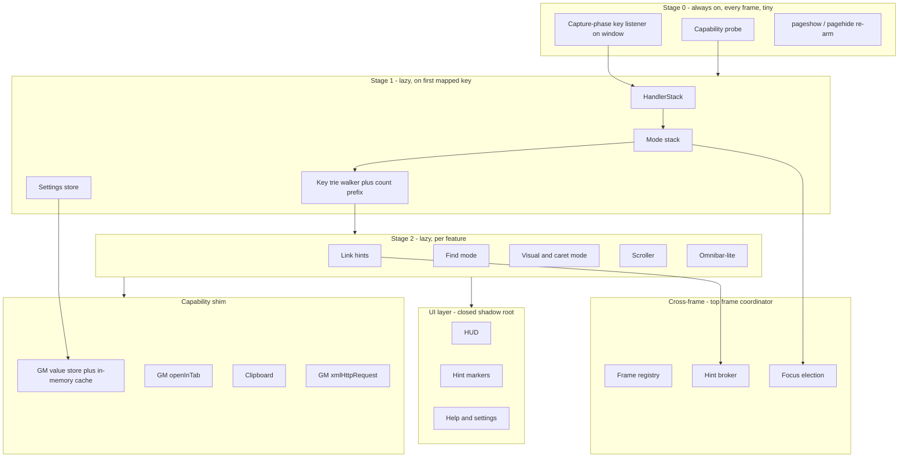
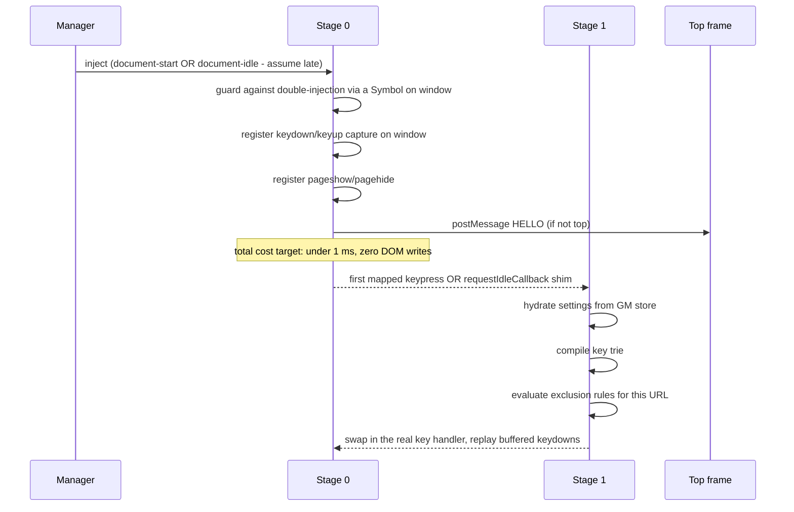
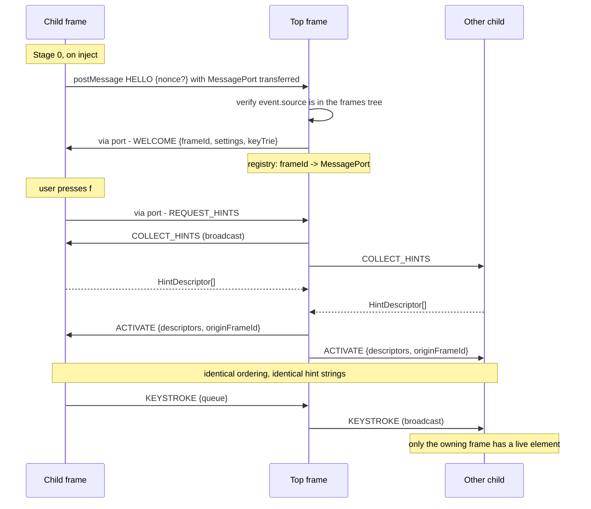

# Vimium-WebKit — Implementation Plan

> A WebKit-compatible reimplementation of
> [Vimium](https://github.com/philc/vimium), distributed as a single userscript
> for Violentmonkey, Tampermonkey, and the Safari-native userscript managers.

**Status:** Implemented · **Target:** `vimium-webkit.user.js` · **Reference
upstream:** Vimium 2.4.2 (MIT)

> [!NOTE]
> This document is the design rationale, and remains the source of truth for
> _why_ things are the way they are. For what is built, how to run it, and the
> published Tier A/B/C table, see [`README.md`](./README.md).
> [§12](#12-empirical-verification-checklist) records which of the load-bearing
> assumptions have since been verified empirically.

---

## Table of contents

1. [Goals and non-goals](#1-goals-and-non-goals)
2. [Executive constraint summary](#2-executive-constraint-summary)
3. [Target platform matrix](#3-target-platform-matrix)
4. [Feature triage: what ports, what degrades, what dies](#4-feature-triage)
5. [Architecture](#5-architecture)
6. [Subsystem designs](#6-subsystem-designs)
7. [WebKit limitation catalogue](#7-webkit-limitation-catalogue)
8. [Userscript-manager limitation catalogue](#8-userscript-manager-limitation-catalogue)
9. [Build, bundling, and distribution](#9-build-bundling-and-distribution)
10. [Testing strategy](#10-testing-strategy)
11. [Phased roadmap](#11-phased-roadmap)
12. [Empirical verification checklist](#12-empirical-verification-checklist)
13. [Licensing and attribution](#13-licensing-and-attribution)

---

## 1. Goals and non-goals

### Goals

- **G1** — Ship a single, self-contained `.user.js` that delivers Vimium's
  _page-level_ keyboard experience: link hints, scrolling, find, visual/caret
  mode, insert mode, marks, and the mode/HUD affordances.
- **G2** — Work correctly on **WebKit** (Safari macOS/iOS/iPadOS, Orion) as the
  primary engine, while remaining fully functional on Chromium and Gecko.
- **G3** — Degrade _visibly and gracefully_. When a capability is missing, the
  user gets a HUD message explaining why — never a silent no-op.
- **G4** — Be a good citizen on every page: no measurable input latency, no
  steady-state CPU burn, no page breakage, no detectable global pollution.
- **G5** — Configurable with Vimium-compatible `map`/`unmap`/`mapkey` syntax so
  existing users can paste their key mappings in.

### Non-goals

- **N1** — Tab and window management (`t`, `x`, `X`, `J`/`K`, `gt`/`gT`, `W`,
  `<<`/`>>`, pin, zoom). A userscript has no `chrome.tabs`. See
  [§4.3](#43-tier-c--not-implementable).
- **N2** — The full Vomnibar backed by browser history and bookmarks. There is
  no `chrome.history` / `chrome.bookmarks` for a userscript. A reduced
  "Omnibar-lite" is in scope; parity is not.
- **N3** — An options _page_. Settings live in an in-page overlay (`Shift+?` →
  Settings) because there is no `options_ui`.
- **N4** — Byte-for-byte porting of Vimium's source. We port _behaviour and
  algorithms_, reimplemented in TypeScript.

> [!IMPORTANT]
> The single most consequential fact in this document: **a userscript is
> content-script-only.** Vimium's service worker owns the key-mapping trie,
> settings, the cross-frame hint broker, the completion engine, and every tab
> command. All of that must be either relocated into the page, emulated with
> `GM_*` APIs, or dropped. [§4](#4-feature-triage) is the honest accounting.

---

## 2. Executive constraint summary

The nine constraints that shape every design decision below.

| #  | Constraint                                                                                                                                                             | Consequence                                                                                        | Detail                                |
| -- | ---------------------------------------------------------------------------------------------------------------------------------------------------------------------- | -------------------------------------------------------------------------------------------------- | ------------------------------------- |
| C1 | No `chrome.tabs`/`windows`/`history`/`bookmarks`/`sessions`                                                                                                            | ~25 Vimium commands are impossible or approximated                                                 | [§4.3](#43-tier-c--not-implementable) |
| C2 | `@run-at document-start` is **unreliable on WebKit** — both a Safari platform bug and an unavoidable async hop in Safari-native managers                               | Cannot assume we beat page scripts. No `attachShadow` interception. Late-boot-safe design required | [§7.1](#71-injection-timing)          |
| C3 | Safari applies the **page's CSP to DOM nodes injected by content scripts** (unlike Chrome)                                                                             | No `<style>` injection, no extension-origin iframes, no `blob:` UI                                 | [§7.2](#72-content-security-policy)   |
| C4 | Safari **reserves ~8 Cmd/Ctrl shortcuts** — the `keydown` never reaches the page                                                                                       | Those key combos are unbindable, full stop                                                         | [§7.3](#73-keyboard)                  |
| C5 | ITP wipes **all** script-writable storage after 7 idle days; partitioned per top-level site; per-tab-ephemeral in Private Browsing                                     | `localStorage` is unusable for settings/marks. Must use `GM_setValue`                              | [§7.4](#74-storage-and-itp)           |
| C6 | `window.open` needs _fresh, synchronous_ transient activation and cannot open background tabs                                                                          | New-tab commands must route through `GM_openInTab`                                                 | [§7.5](#75-opening-tabs)              |
| C7 | `requestIdleCallback` is **still unshipped** in Safari 26.5                                                                                                            | Must polyfill; hint generation needs manual chunking                                               | [§7.6](#76-scheduling)                |
| C8 | No background broker for cross-frame coordination                                                                                                                      | Top frame must elect itself coordinator over `postMessage` + `MessageChannel`                      | [§6.5](#65-cross-frame-coordination)  |
| C9 | GM API surface varies wildly across managers; quoid/Userscripts is the floor (no `unsafeWindow`, no `GM_addElement`, no `GM_registerMenuCommand`, promise-only `GM.*`) | Every `GM_*` call goes through a capability-detecting shim                                         | [§6.2](#62-the-capability-layer)      |

---

## 3. Target platform matrix

### 3.1 Manager support tiers

| Tier                       | Manager                                                                                                        | Engine      | Why                                                                                                                                    |
| -------------------------- | -------------------------------------------------------------------------------------------------------------- | ----------- | -------------------------------------------------------------------------------------------------------------------------------------- |
| **1 — Reference**          | Tampermonkey (Chrome/Firefox)                                                                                  | Blink/Gecko | Richest API; primary dev target                                                                                                        |
| **1 — Reference**          | Violentmonkey (Chrome/Firefox)                                                                                 | Blink/Gecko | Richest API; `@inject-into` control                                                                                                    |
| **1 — Primary WebKit**     | [Tampermonkey for Safari](https://apps.apple.com/us/app/tampermonkey/id6738342400) (WebExtension build, $2.99) | WebKit      | The only WebKit manager with a near-complete GM surface                                                                                |
| **2 — Constrained WebKit** | [Userscripts by quoid](https://github.com/quoid/userscripts) (free, GPL-3.0)                                   | WebKit      | The community default on iOS, and our **capability floor**                                                                             |
| **2 — WebKit**             | [Stay for Safari](https://apps.apple.com/us/app/stay-for-safari/id1591620171)                                  | WebKit      | Has `unsafeWindow` + menu commands; OSS docs may lag shipping app                                                                      |
| **3 — Best effort**        | Violentmonkey on Orion                                                                                         | WebKit      | Orion has a [script-source corruption bug](https://github.com/violentmonkey/violentmonkey/issues/2363) across restarts                 |
| **4 — Out of scope**       | GNOME Web / Epiphany                                                                                           | WebKit      | No userscript manager at all; only a single `user-javascript.js` injected at `document-end`, all-frames, page-world, no metadata block |

> [!NOTE]
> **Violentmonkey has no Safari build and no plans for one**
> ([#303](https://github.com/violentmonkey/violentmonkey/issues/303)). On
> WebKit, "Violentmonkey" means "Violentmonkey running inside Orion." Our
> install docs must say this plainly.

### 3.2 The compatibility floor

Code against the intersection of Tampermonkey ∩ Violentmonkey ∩ quoid:

```
GM.setValue / getValue / deleteValue / listValues   (promise form only)
GM.info
GM.xmlHttpRequest
GM.openInTab
GM.setClipboard
GM.addStyle          ← available, but we prefer adoptedStyleSheets
```

**Everything else requires runtime feature detection with a defined fallback.**
Notably _not_ in the floor: `unsafeWindow`, `GM_addElement`,
`GM_registerMenuCommand`, `GM_addValueChangeListener`, `GM_notification`,
`@resource`, `@top-level-await`, `@sandbox`, `window.close` grant.

### 3.3 Minimum engine versions

| Engine               | Minimum   | Gated by                                                          |
| -------------------- | --------- | ----------------------------------------------------------------- |
| Safari / iOS Safari  | **16.4**  | `adoptedStyleSheets` on `ShadowRoot`; `CSSStyleSheet` constructor |
| Safari (recommended) | **17.4+** | `Element.checkVisibility()`, `Selection.getComposedRanges()`      |
| Chrome / Edge        | 111       | `adoptedStyleSheets` writability                                  |
| Firefox              | 101       | ditto                                                             |

Below Safari 16.4 we fall back to `<style>` inside the shadow root, which is
CSP-fragile. Declare 16.4 as the floor and emit a one-time HUD warning below it.

---

## 4. Feature triage

Every Vimium command, classified. This is the contract with users — it belongs
in the README verbatim.

### 4.1 Tier A — full parity (pure DOM)

No GM API required. Works identically on every target.

| Commands                                            | Notes                                                                                      |
| --------------------------------------------------- | ------------------------------------------------------------------------------------------ |
| `j` `k` `h` `l` `d` `u` `gg` `G` `zH` `zL`          | Custom rAF easing, not CSS `smooth` — see [§6.6](#66-scrolling)                            |
| `f` `F` `<a-f>` `yf` — link hints                   | Closed shadow roots excepted, see [§7.7](#77-shadow-dom)                                   |
| `/` `n` `N` `*` `#` — find mode                     | Custom `TreeWalker` + `Range`, not `window.find()`                                         |
| `v` `V` `c` — visual / visual-line / caret mode     | `Selection.modify()` is a **WebKit-native** API — this subsystem is the _safest_ on Safari |
| `i` — insert mode, `<Esc>` semantics, pass-next-key |                                                                                            |
| `gi` — focus input, with overlay selector           |                                                                                            |
| `[[` `]]` — prev/next link heuristics               |                                                                                            |
| `gu` `gU` — URL hierarchy                           |                                                                                            |
| `H` `L` — history back/forward                      | `history.go(±n)`                                                                           |
| `r` `R` — reload                                    | `location.reload()`; hard-reload approximated with a cache-busting query param             |
| `gs` — view source                                  | Opens `view-source:` via `GM_openInTab`; falls back to a HUD error                         |
| `?` — help dialog                                   | In-page shadow-DOM overlay                                                                 |
| `m` `` ` `` — **local** marks                       | Per-URL scroll positions                                                                   |

### 4.2 Tier B — degraded or GM-dependent

| Command                      | Approach                                                                                        | Degradation                                                                                                                                 |
| ---------------------------- | ----------------------------------------------------------------------------------------------- | ------------------------------------------------------------------------------------------------------------------------------------------- |
| `t` `O` `B` `F` (new tab)    | `GM_openInTab(url, {active:false, insert:true})`                                                | Missing on no manager in our matrix — but a user with `@grant none` gets a foreground `window.open` and popup-blocker risk                  |
| `yy` `yf` `yt` (copy)        | `navigator.clipboard.writeText()` synchronously in the keydown task; `GM_setClipboard` fallback | Must not `await` before the write — activation is consumed                                                                                  |
| `p` `P` (open clipboard URL) | `GM_setClipboard` cannot read. Use `navigator.clipboard.readText()`                             | **On WebKit this shows a native paste prompt or rejects.** Offer a HUD input box as the primary path and clipboard read as opt-in           |
| `x` (close tab)              | `@grant window.close` (VM/TM)                                                                   | **Unavailable on quoid/Stay** → HUD: "close-tab requires Tampermonkey or Violentmonkey"                                                     |
| `zi` `zo` `z0` (zoom)        | CSS `zoom` on `documentElement`, persisted per-origin                                           | Not real browser zoom: does not affect the URL bar, does not persist across managers, breaks `position:fixed` on some sites. Off by default |
| `<a-m>` (mute)               | Mute every `<audio>`/`<video>` + a `MutationObserver` for new media                             | Only mutes media elements; WebAudio unaffected                                                                                              |
| `M` `` ` `` (global marks)   | Store `{url, scrollX, scrollY}` in `GM_setValue`; jump via `GM_openInTab`                       | Cannot focus an _already-open_ tab — always opens a new one                                                                                 |
| `o` `:` (Omnibar-lite)       | Own frecency index + search engines + open tabs _we_ know about                                 | See [§6.7](#67-omnibar-lite)                                                                                                                |
| `gf` `gF` (frame nav)        | Own frame registry over `MessageChannel`                                                        | Cannot see frames where the script failed to inject (CSP-sandboxed, pre-18.4 `about:blank`)                                                 |

### 4.3 Tier C — not implementable

Bound to a no-op that shows a HUD explanation with the native Safari equivalent.

| Command                                                  | Why                                                                                          | Suggested native alternative shown in HUD |
| -------------------------------------------------------- | -------------------------------------------------------------------------------------------- | ----------------------------------------- |
| `J` `K` `gt` `gT` `^` `g0` `g$`                          | No tab enumeration or activation API                                                         | `⌘⇧[` / `⌘⇧]`, `⌘1`–`⌘9`                  |
| `X` (restore tab)                                        | No `chrome.sessions`                                                                         | `⌘⇧T`                                     |
| `W` (tab → new window)                                   | No API                                                                                       | —                                         |
| `<<` `>>` (move tab)                                     | No API                                                                                       | —                                         |
| `<a-p>` (pin tab)                                        | No API                                                                                       | Right-click the tab                       |
| `closeTabsOnLeft/Right/Other`                            | No API                                                                                       | Right-click the tab                       |
| Vomnibar over browser history/bookmarks                  | No `chrome.history` / `chrome.bookmarks`                                                     | `⌘L`                                      |
| Incognito hint (`LinkHints.activateModeToOpenIncognito`) | No `chrome.windows.create({incognito})`                                                      | —                                         |
| Download hint                                            | Vimium alt-clicks; untrusted synthetic modifier clicks do not trigger WebKit's download path | —                                         |

> [!TIP]
> Tier C is a _feature_, not just a gap. Rendering these in the `?` help dialog
> greyed-out with the native shortcut alongside turns a missing capability into
> a discoverability win.

---

## 5. Architecture

### 5.1 High-level



### 5.2 Boot sequence

Because `document-start` is unreliable on WebKit
([C2](#2-executive-constraint-summary)), boot is **staged and idempotent**:



Stage 0 buffers up to N keydowns while Stage 1 hydrates (settings hydration is
async on every manager because `GM.getValue` is promise-only on quoid). This
mirrors Vimium's `CacheAllKeydownEvents` mode.

> [!WARNING]
> **Do not build UI in Stage 0.** With 5–20 frames per page, per-frame DOM
> writes at injection time are the classic userscript CPU sink. Subframes should
> stay at Stage 0 permanently unless focused or asked for hints.

### 5.3 `@grant` and world strategy

This is the trickiest single decision, because the two axes conflict:

|                                            | Page world                                                   | Content world           |
| ------------------------------------------ | ------------------------------------------------------------ | ----------------------- |
| **GM APIs**                                | Absent on quoid; present via `unsafeWindow` bridge elsewhere | ✅ available everywhere |
| **Page CSP applies to our injected nodes** | Yes on WebKit                                                | Yes on WebKit           |
| **Can monkey-patch `attachShadow`**        | ✅                                                           | ❌                      |
| **Detectable/removable by the page**       | ✅ vulnerable                                                | ❌ hidden               |
| **Key-event ordering**                     | Identical — world does not affect DOM dispatch order         | Identical               |

**Decision: content world.** Rationale:

1. GM storage is non-negotiable ([C5](#2-executive-constraint-summary)) and on
   quoid the GM API _only_ exists in the content world.
2. World choice does **not** affect keyboard interception. Both worlds share one
   DOM and one event path; a capture-phase listener on `window` wins on
   registration order regardless of world.
3. `attachShadow` patching is the only real loss — and it is already unreliable
   on WebKit because of [C2](#2-executive-constraint-summary). Closed shadow
   roots are accepted as a permanent gap.

Metadata block:

```javascript
// @grant        GM.setValue
// @grant        GM.getValue
// @grant        GM.deleteValue
// @grant        GM.listValues
// @grant        GM.openInTab
// @grant        GM.setClipboard
// @grant        GM.xmlHttpRequest
// @grant        GM.info
// @grant        GM_registerMenuCommand      // progressive enhancement
// @grant        GM_addValueChangeListener   // progressive enhancement
// @grant        window.close                // progressive enhancement
// @inject-into  content                     // Violentmonkey, quoid
```

> [!CAUTION]
> **Never ship without an explicit `@grant`.** Violentmonkey 2.32.0 changed
> no-`@grant` from "assume `none`" to "sandboxed", silently breaking scripts
> that relied on the old behaviour. And in Tampermonkey, "no `@grant` lines" and
> `@grant none` are _different_ modes.

### 5.4 Module layout

```
src/
  boot/
    stage0.ts            Minimal always-on shim; double-injection guard
    stage1.ts            Lazy core init; keydown replay
    lifecycle.ts         pageshow/pagehide, SPA URL-change detection
  platform/
    capabilities.ts      Runtime probe -> Capabilities record
    gm.ts                neverthrow-wrapped GM_* shim with fallbacks
    storage.ts           Namespaced, cached, schema-validated value store
    clipboard.ts         Activation-aware write; guarded read
    tabs.ts              openInTab / close / focus, with Tier-C messaging
    scheduler.ts         requestIdleCallback polyfill + chunked work queue
  core/
    handler-stack.ts     Port of Vimium's HandlerStack
    mode.ts              Mode base class, singleton groups, indicators
    key-handler.ts       Trie walk, count prefix, pass keys
    key-notation.ts      Event -> "<c-a>" notation; layout handling
    mappings.ts          map/unmap/unmapAll/mapkey parser -> trie
    commands.ts          Command registry + tier metadata
    exclusions.ts        Per-URL enable/passKeys rules
  features/
    hints/               Detection, scoring, marker rendering, filter modes
    find/                Query parsing, TreeWalker match engine, highlight
    visual/              Movement, VisualMode, VisualLineMode, CaretMode
    scroller.ts          rAF easing, scrollable-ancestor discovery
    marks.ts             Local + global marks
    insert.ts            Insert mode, focus tracking through shadow roots
    omnibar/             Frecency index, search engines, UI
  ui/
    root.ts              Closed shadow host + adoptedStyleSheets
    hud.ts               Messages, mode indicator, find input
    dialog.ts            Help + settings overlays
    styles.ts            CSS as template strings (no external files)
  frames/
    registry.ts          Frame discovery, MessageChannel handshake
    protocol.ts          Zod-validated message schemas
    coordinator.ts       Top-frame broker: hints, focus election
  settings/
    schema.ts            Zod schema + defaults + migrations
```

### 5.5 Language and error handling

- **TypeScript, strict, no `any`.** `unknown` + narrowing at every boundary.
- **[Zod](https://zod.dev) v4 (`zod/mini`)** for: the settings schema, the
  cross-frame message protocol, and parsing anything read out of `GM_getValue`.
  Storage is shared across script versions and frames — treat it as untrusted.
- **[neverthrow](https://github.com/supermacro/neverthrow)** for the capability
  layer, storage, clipboard, and tab operations. Every one of these can fail for
  manager-specific reasons, and `Result` forces us to have a HUD message for
  each failure rather than an unhandled rejection.
- Hot paths (key dispatch, hint rect computation) stay plain and
  allocation-free; `Result` is for I/O boundaries, not for the inner loop.

> [!NOTE]
> **Bundle budget.** `zod/mini` + `neverthrow` cost roughly 15–20 KB minified.
> Greasy Fork's ceiling is 2 MB _unminified_, so there is ample headroom — but
> parse-and-compile cost is paid **per frame**, so keep the Stage 0 chunk free
> of both. Measure the Stage 0 chunk in the profiler; target < 5 KB.

---

## 6. Subsystem designs

### 6.1 Keyboard interception

Port Vimium's `HandlerStack` + `Mode` + `KeyHandlerMode` largely as-is — the
design is sound and engine-neutral.

- Listeners on `globalThis`, **capture phase**, for
  `keydown`/`keypress`/`keyup`.
- Sentinel return values preserved: `continueBubbling`, `suppressEvent`,
  `suppressPropagation`, `passEventToPage`, `restartBubbling`.
- Suppressed `keydown` arms a `keyup` consumer keyed on `event.code`, so pages
  listening for `keyup` don't see phantoms.
- Guard every handler with `if (e.isComposing || e.keyCode === 229) return;` —
  IME and dead-key composition.
- `keyState` is a **list** of trie nodes, not a single node. This is what makes
  `gg` work while `g` is also a live prefix and lets a fresh sequence start
  mid-sequence.

WebKit-specific additions:

| Issue                                                                                                                                   | Mitigation                                                                                                                            |
| --------------------------------------------------------------------------------------------------------------------------------------- | ------------------------------------------------------------------------------------------------------------------------------------- |
| Safari never dispatches `keydown` for `⌘N/W/Q/T/R/L`, `⌃Tab`, `⌃⇧Tab` ([w3c/uievents#65](https://github.com/w3c/uievents/issues/65))    | Mapping parser **rejects** these bindings with a clear settings-validation error, rather than accepting a binding that can never fire |
| `⌘S/P/F/D` _are_ preventable on macOS but [possibly not on iOS](https://bugs.webkit.org/show_bug.cgi?id=191768)                         | Allowed, but flagged "may not work on iOS" in the help dialog                                                                         |
| macOS Safari does not Tab to links by default                                                                                           | Never rely on native tab order. Raises the value of link hints                                                                        |
| iOS hardware-keyboard `keydown` historically required a focused element; special keys arrive as AppKit PUA codepoints `U+F700`–`U+F8FF` | Normalisation table in `key-notation.ts`, mirroring [WebKit r236678](https://trac.webkit.org/changeset/236678)                        |
| We may lose the registration race to page scripts ([C2](#2-executive-constraint-summary))                                               | `stopImmediatePropagation()` (not just `stopPropagation()`) when suppressing; re-register on `pageshow`                               |

### 6.2 The capability layer

A single probe at Stage 1 produces an immutable `Capabilities` record, and every
feature branches on it. This is also the first thing dumped into a bug report.

```typescript
type Capabilities = Readonly<{
  manager:
    | "violentmonkey"
    | "tampermonkey"
    | "userscripts"
    | "stay"
    | "unknown";
  managerVersion: string | null;
  world: "page" | "content" | "unknown";

  // GM surface
  value: "gm-sync" | "gm-async" | "localstorage-fallback";
  valueChangeListener: boolean; // cross-tab sync
  openInTab: boolean;
  openInTabBackground: boolean;
  setClipboard: boolean;
  xhr: boolean;
  menuCommand: boolean;
  windowClose: boolean;

  // Platform surface
  adoptedStyleSheets: boolean; // Safari 16.4+
  checkVisibility: boolean; // Safari 17.4+
  composedRanges: boolean; // Safari 17+
  caretPositionFromPoint: boolean; // Safari 26.2+
  clipboardWrite: boolean; // secure context
  idleCallback: boolean; // false on all shipping Safari
  visualViewport: boolean;
}>;
```

Rules:

1. **Probe, don't sniff.** `typeof GM_addElement === "function"`, never a
   `GM_info.scriptHandler` string comparison for capability decisions. `manager`
   is recorded for diagnostics only.
2. **Every `false` has a defined behaviour**, and if that behaviour is
   user-visible, it produces a HUD message on first attempt — not a console
   warning nobody reads.
3. Expose the record via `:capabilities` in the Omnibar and in the help dialog
   footer, copy-pasteable.

**Storage fallback chain:**

```
GM.setValue/getValue  →  GM_setValue/getValue (sync)  →  localStorage
```

`localStorage` is a **last resort with an explicit warning**, because of ITP's
7-day wipe ([C5](#2-executive-constraint-summary)). If we land there, the HUD
says so once per session: _"Settings will be erased after 7 days of inactivity —
install Tampermonkey or Userscripts for durable storage."_

### 6.3 UI layer — closed shadow root, CSSOM styling

This is the single highest-leverage design decision for WebKit. It solves page
CSP, page CSS bleed, and detectability at once.

```typescript
const host = document.createElement("div");
host.style.cssText =
  "all:initial;position:fixed;inset:0;pointer-events:none;z-index:2147483647";
document.documentElement.appendChild(host);

const root = host.attachShadow({ mode: "closed" });

if ("adoptedStyleSheets" in root) { // Safari 16.4+
  const sheet = new CSSStyleSheet();
  sheet.replaceSync(UI_CSS);
  root.adoptedStyleSheets = [sheet];
} else {
  root.append(
    Object.assign(document.createElement("style"), { textContent: UI_CSS }),
  );
}
```

Why each piece matters:

- **`adoptedStyleSheets` instead of `<style>`** — Safari enforces the page's
  `style-src` on content-script-injected DOM nodes. CSSOM insertion is not a
  `style-src` fetch. This is our CSP escape hatch, and unlike `GM_addElement` it
  exists on _every_ manager.
- **`mode: "closed"`** — the page cannot walk into our tree, restyle it, or
  remove it by selector.
- **`all: initial`** — page CSS cannot leak in through inherited properties.
- **No iframes.** Vimium hosts the HUD, Vomnibar, and help dialog in
  `web_accessible_resources` iframes. We have no such thing, and `frame-src`
  would block extension-origin or `blob:` frames anyway. Everything is in-page
  DOM inside the shadow root.
- Losing the iframe also loses Vimium's `vimiumSecret` handshake and its
  clipboard bridge — see [§6.4](#64-clipboard).

**Consequences to design around:**

- The HUD's find input is a real in-page element, so it participates in the
  page's focus. Guard it: our own `InsertMode` must recognise the HUD input as
  _ours_ and not treat focus there as entering the page's insert mode.
- On iOS, position the overlay against `visualViewport`, not
  `window.innerHeight` ([§7.8](#78-viewport-and-geometry)).

### 6.4 Clipboard

Vimium routes clipboard through a same-origin extension iframe. We cannot.

**Write (`yy`, `yf`, `yt`, visual-mode `y`):**

```typescript
// MUST be synchronous within the keydown task — activation is consumed
// and Safari's transient-activation window is well under 1 s.
navigator.clipboard.writeText(url); // do NOT await anything first
```

Fallback chain: `navigator.clipboard.writeText` → `GM_setClipboard` →
hidden-textarea + `document.execCommand("copy")` (needed on `http://` origins
where `navigator.clipboard` is `undefined`).

Multi-key sequences are fine: the _second_ keydown of `yy` carries the
activation.

**Read (`p`, `P`):** On WebKit `navigator.clipboard.readText()` either shows a
native paste prompt (context menu on macOS, callout bar on iOS) or rejects —
unless the clipboard content was written by the same origin. This is a genuinely
bad UX for a keyboard-driven tool.

**Decision:** `p`/`P` opens a HUD input box pre-focused, and _attempts_ a
`readText()` to pre-fill it. If the read is denied or times out (250 ms), the
user just pastes with `⌘V` into the box we already gave them. This turns a hard
failure into one extra keystroke.

### 6.5 Cross-frame coordination

No background broker. The **top frame elects itself coordinator.**



Design points, adapted from Vimium's protocol:

- **`MessagePort` transfer over cross-origin `postMessage` works.** Each child
  creates a `MessageChannel` and transfers `port2` to the top frame in its
  `HELLO`. This gives a direct duplex channel per frame and avoids
  re-broadcasting through `window.postMessage` on every keystroke.
- **Frame identity is verifiable.** `event.source === window.frames[i]` compares
  window identities and works cross-origin. Validate `HELLO` against the frames
  tree.
- **A `HintDescriptor` is `{frameId, localIndex, linkText}`** — a lightweight
  global handle. The heavy `LocalHint` (element ref, rect) never leaves its
  owning frame. Vimium notes stripping each frame's own descriptors from its
  reply payload was a _150% speedup_ on link-dense sites; do the same.
- **Deterministic ordering** — sort descriptors by `frameId` then `localIndex`,
  so every frame independently derives an identical hint-string assignment with
  no further coordination.
- **Every request is time-boxed** (3 s, per Vimium) and errors are swallowed, so
  a hung frame cannot deadlock the mode.
- **Buffer keys during the round trip** in the originating frame and replay
  after activation (filter mode only), with a 1 s safety timer.

**Security note — accept and document.** A malicious page can post messages that
look like our protocol. Mitigations: validate `event.source` against the frames
tree, validate payloads with Zod, and use a per-session nonce distributed
top-down. None of this is airtight in page world (the page shares our realm),
but in content world the page cannot read the nonce. Worst realistic case is
spoofed hint descriptors pointing at page-controlled elements — which the page
could click itself anyway. **Severity: low. Do not over-engineer.**

**Frames we will never reach:**

- CSP-`sandbox`ed iframes — Safari and Firefox do not inject content scripts
  ([w3c/webextensions#285](https://github.com/w3c/webextensions/issues/285)).
- `about:blank` / `srcdoc` / `data:` frames below **Safari 18.4**
  (`match_about_blank` and `match_origin_as_fallback` landed then).
- Cross-origin frames at 30 fps until the user interacts with them
  ([WebKit r215070](https://trac.webkit.org/changeset/215070/webkit)) — prefer
  CSS transitions over rAF for overlay animation.

### 6.6 Scrolling

Port Vimium's `CoreScroller`, including its keyboard-repeat calibration — that
logic is the difference between "scrolling feels right" and "scrolling feels
cheap."

```
duration      = max(100, 20 * ln(amount))
delta[frame]  = ceil(amount * (elapsed / duration) * calibration)
calibration  ∈ [0.5, 1.6], adjusted after 75 ms toward ~150 px/frame
```

- **One animator per keypress** (so two quick taps land where two slow taps do);
  during key repeat, the running animator continues and no new one starts.
- `myKeyIsStillDown()` compares a monotonic counter bumped on non-repeat
  `keydown`, matching `keyup` (by `event.code`), **and `window` blur** — the
  blur case guards against dropped `keyup` events.
- **Use `scrollBy({behavior: "instant"})` and animate ourselves.** Safari's
  `smooth` easing is not cancellable and stacking `smooth` calls at key-repeat
  rate produces visible fighting. (`behavior: "smooth"` did not actually animate
  in Safari until **15.4**, which is another reason not to depend on it.)
- **`document.scrollingElement` unconditionally** for root scrolling. Never
  branch on `document.body` vs `documentElement` — this is precisely the WebKit
  quirk `scrollingElement` was introduced to paper over.
- **Scrollable-ancestor discovery**: walk up checking
  `getComputedStyle(el).overflowY ∈ {auto, scroll, overlay}` **and**
  `scrollHeight > clientHeight`, then confirm empirically by scrolling ±1 px and
  checking for movement (Vimium does this because `scrollHeight`/`clientHeight`
  are unreliable). Note Safari uses overlay scrollbars by default, so
  `clientWidth` deltas cannot be used as a scrollability signal.

### 6.7 Omnibar-lite

The Vomnibar is where a userscript port hurts most. There is no history API and
no bookmarks API. Rather than ship a crippled `⌘L` clone, reframe the feature.

**What `o` opens:**

| Source                     | How                                                                                            | Notes                                                                                                                  |
| -------------------------- | ---------------------------------------------------------------------------------------------- | ---------------------------------------------------------------------------------------------------------------------- |
| **Our own frecency index** | Record `{url, title, visitCount, lastVisit}` in GM storage on each page load                   | Opt-in, off by default. Capped (e.g. 5 000 entries, LRU). Ships with a `:clear-history` command and a per-site opt-out |
| **Search engines**         | Vimium-compatible `keyword: url %s` config                                                     | Zero-cost, high value                                                                                                  |
| **Search suggestions**     | `GM_xmlHttpRequest` to the engine's suggest endpoint, debounced 100 ms, 2.5 s abort, 2 h cache | Requires `@connect`; **absent on quoid** → degrade to no suggestions                                                   |
| **Open tabs**              | Only tabs _we_ opened via `GM_openInTab` and that are still alive (heartbeat in GM storage)    | Genuinely partial. Label it "Recent" not "Tabs" to avoid implying completeness                                         |
| **Commands** (`:`)         | The command registry, incl. greyed-out Tier C entries                                          | Full parity — this one is easy and useful                                                                              |

> [!WARNING]
> **Privacy.** A userscript building its own browsing-history index is a
> meaningful privacy surface, and GM storage is readable by the manager UI. It
> must be **opt-in**, documented prominently in the README, exclude
> private-browsing sessions, honour an origin denylist, and never leave the
> device.

Scoring: port Vimium's relevancy shape — whole-word-on-first-token `8`,
whole-word `4`, prefix-on-first `6`, prefix `2`, substring `1`, and zero out the
whole candidate if any query token scores 0; then divide by
`ln(1 + titleLength || 100)` so shorter titles win.

### 6.8 Link hints

Port Vimium's pipeline; the algorithm is the crown jewel and is engine-neutral.

**Detection order** (from `LocalHints.getLocalHints`): image maps →
`aria-disabled` hard-reject → framework click attributes (`ng-click` variants,
Google `jsaction`) → `onclick` → `role` allowlist → `contentEditable` → native
tags (`a`, `input`, `button`, `select`, `textarea`, `object`, `embed`, `label`,
`details`, zoomable `img`, scrollable `div`/`ol`/`ul`) → `class` containing
`button`/`btn` (flagged _possible false positive_) → `span` (flagged) →
non-negative `tabindex` (flagged _second-class citizen_).

Then: reverse (descendants first) → false-positive filter over a 6-hint
look-back window and 3 levels of `parentElement` → occlusion test at the rect
centre plus four corners nudged 0.1 px inward → reverse again → offset by
viewport origin.

**Hint string generation** — breadth-first mixed-radix built _backwards_, then
sorted and reversed. The sort-then-reverse is what scatters short hints evenly:

```typescript
let hints = [""], offset = 0;
while (hints.length - offset < linkCount || hints.length === 1) {
  const hint = hints[offset++];
  for (const ch of alphabet) hints.push(ch + hint);
}
return hints.slice(offset, offset + linkCount)
  .sort()
  .map(reverseString);
```

**Filter mode** — two queues (digits vs link text), renumber on every keystroke,
Vimium's word-scoring, `Tab`/`⇧Tab` to cycle, `Enter` to activate, and the
single-match confirmation (explicit `Enter`, or a 200 ms typing pause).

**WebKit-specific changes:**

| Change                                                                                                                 | Reason                                                                                                                                             |
| ---------------------------------------------------------------------------------------------------------------------- | -------------------------------------------------------------------------------------------------------------------------------------------------- |
| Chunk detection through the scheduler, 8 ms slices                                                                     | `requestIdleCallback` is unshipped in Safari ([§7.6](#76-scheduling)); a synchronous pass over 5 000 nodes will jank                               |
| `Element.checkVisibility({contentVisibilityAuto: true})` when available (Safari 17.4+), else `getComputedStyle` checks | `content-visibility: auto` shipped in Safari 18 and `getBoundingClientRect()` reports misleading values inside skipped subtrees                    |
| Recursive descent into **open** shadow roots via `element.shadowRoot`; `elementsFromPoint` for occlusion               | `document.elementFromPoint` returns the _retargeted_ host, per spec                                                                                |
| **Closed shadow roots produce no hints.** Detect the situation and HUD "some elements on this page are not reachable"  | `attachShadow` patching needs reliable `document-start`, which WebKit does not give us                                                             |
| Position markers against `visualViewport` on iOS                                                                       | Layout vs visual viewport divergence under the dynamic toolbar                                                                                     |
| Do **not** use `IntersectionObserver` for hint eligibility                                                             | Async, layout-viewport-relative, and observing thousands of nodes is the wrong shape. Synchronous `getBoundingClientRect()` as Vimium does         |
| No `popover` reliance for the marker container                                                                         | Use the shadow host with `z-index: 2147483647` instead; `popover` support varies and the closed shadow root already escapes page stacking contexts |

**Activation** — dispatch the full sequence
`pointerover, mouseover, pointerdown,
mousedown, pointerup, mouseup, click`,
focusing `input`/`select`/`object`/`embed` first. Keep a `WeakRef` to the
last-clicked element so a later `Escape` can dispatch `mouseout` (fixes
hover-preview stickiness).

> [!NOTE]
> Synthetic modifier-clicks (`ctrlKey`/`metaKey`) do **not** open new tabs in
> WebKit — untrusted events don't reach the browser's own activation path.
> New-tab hints must extract the `href` and call `GM_openInTab`. This also means
> the download hint (which Vimium implements as a synthetic alt-click) is Tier
> C.

### 6.9 Find mode

Custom `TreeWalker` + `Range` engine, **not** `window.find()`.

- `window.find()` is non-standard, gives no match count, cannot enumerate
  matches, mutates the user's selection as a side effect, and cannot see into
  shadow DOM. Vimium already rolls its own; so do we.
- Highlight with `Range` + our own overlay rects in the shadow root (page CSS
  can't be trusted to leave `::selection` alone).
- Smartcase and `/regex/` mode, as upstream.
- Find query history in GM storage (Vimium uses `chrome.storage.session`; we
  have no session tier, so use a versioned key trimmed to 50 entries).
- `⌘F` _is_ preventable on macOS, so we could shadow native find — but
  [possibly not on iOS](https://bugs.webkit.org/show_bug.cgi?id=191768). `/` is
  the primary binding; `⌘F` shadowing is opt-in and off by default.

### 6.10 Visual and caret mode

**The good news section.** `Selection.modify()` is a WebKit-originated API,
supported since Safari 1.3. This subsystem ports almost unchanged.

- `alterMethod` is `"extend"` for visual mode and `"move"` for caret mode — that
  one flag is the entire semantic difference.
- Granularities: `character`, `word`, `line`, `lineboundary`, `sentence`,
  `paragraph`, `documentboundary`.
- Keep Vimium's hand-rolled forward-`word` and `vimword` motions; native word
  movement differs across platforms.
- `getDirection()` by empirical probe: extend one character forward, observe
  growth or shrinkage, undo.
- Point → caret conversion, feature-detected in this order (**inverted**
  relative to the usual Chromium advice, because `caretPositionFromPoint` only
  landed in **Safari 26.2**):

```typescript
const caretAt = (x: number, y: number) => {
  if (document.caretPositionFromPoint) { // standard; Safari 26.2+
    const p = document.caretPositionFromPoint(x, y);
    return p && { node: p.offsetNode, offset: p.offset };
  }
  const r = document.caretRangeFromPoint(x, y); // WebKit legacy; Safari 5+
  return r && { node: r.startContainer, offset: r.startOffset };
};
```

- `ShadowRoot.getSelection()` is **not implemented** in Safari. Use
  `Selection.getComposedRanges()` (Safari 17+) when shadow-aware reads are
  needed, with a non-shadow fallback below that.
- Caret-mode anchor: `TreeWalker(document.body, SHOW_TEXT)` for the first text
  node with ≥ 50 non-whitespace characters whose parent has a visible client
  rect and is not editable.

### 6.11 Settings, mappings, exclusions

- **Storage**: one GM key per logical group (`settings`, `mappings`, `marks`,
  `history`, `findHistory`) rather than one giant blob — reduces write
  amplification and lets a corrupt group be reset independently.
- **Validation**: Zod-parse on every read. On parse failure, fall back to
  defaults and HUD a message with a `:reset-settings` hint. Never throw at boot.
- **Migrations**: a `schemaVersion` integer and an ordered migration list, run
  at Stage 1. Vimium's own `migratePre2_0` / `migratePre2_4` history is a
  warning: build this in from v0.1.
- **Mapping syntax**: Vimium-compatible `map` / `unmap` / `unmapAll` / `mapkey`,
  with `#` and `"` comments and `\` line continuation. Validate options against
  the command registry so typos surface. **Additionally reject bindings using
  Safari-reserved key combos** ([§7.3](#73-keyboard)) with a specific error.
- **Cross-tab sync**: `GM_addValueChangeListener` when available (VM/TM); the
  portable fallback is to re-read settings on `visibilitychange`. quoid and Stay
  have no change-listener primitive at all.
- **Exclusion rules**: implemented in JS (glob → regex), evaluated at Stage 1
  and again on SPA URL change. Note we evaluate against **this frame's** URL,
  whereas Vimium evaluates against the _top_ frame's URL via `sender.tab.url`.
  Match Vimium: child frames ask the top frame for the effective rule.

---

## 7. WebKit limitation catalogue

Verdict key: 🔴 blocker · 🟠 degradation · 🟢 non-issue · ⚪️ unverified

### 7.1 Injection timing

| Item                                                                                                                                                                                                                        | Status                                                         | Impact                                                                      |
| --------------------------------------------------------------------------------------------------------------------------------------------------------------------------------------------------------------------------- | -------------------------------------------------------------- | --------------------------------------------------------------------------- |
| `run_at: document_start` unreliable in macOS Safari (FB10033445) — scripts frequently run at `readyState` `interactive`/`complete`                                                                                          | 🔴 Reported fixed in Safari 18 / STP 192, **unverified by us** | No `attachShadow` interception; may lose the key-listener registration race |
| iOS "Preload Top Hit" (default **on**) breaks `document_start` (FB9157626)                                                                                                                                                  | 🔴 Reported fixed                                              | Same                                                                        |
| Manager-level async hop: quoid states _"document-start appears to run at a readyState of 'complete' on every subsequent page load"_ ([#623](https://github.com/quoid/userscripts/issues/623))                               | 🔴 **Not fixed, not fixable**                                  | Same                                                                        |
| The VM/TM "instant inject" trick (blob URL via `Set-Cookie` + sync XHR) requires **blocking `webRequest`**, which Safari does not have ([quoid#459](https://github.com/quoid/userscripts/issues/459), closed _not planned_) | 🔴 Permanent                                                   | Same                                                                        |
| Safari may lazily load extensions in background tabs until first visit                                                                                                                                                      | ⚪️ Community report only                                       | Re-arm on `pageshow`/`visibilitychange`                                     |

**Mitigation:** staged, idempotent, late-boot-safe initialisation
([§5.2](#52-boot-sequence)); re-register listeners on `pageshow`; accept closed
shadow roots as unreachable.

### 7.2 Content Security Policy

| Item                                                                                                                                                                                | Status              |
| ----------------------------------------------------------------------------------------------------------------------------------------------------------------------------------- | ------------------- |
| Page CSP does **not** apply to content-script _code_ — Apple confirms _"content scripts run in their own world"_ ([forum 651542](https://developer.apple.com/forums/thread/651542)) | 🟢                  |
| Page CSP **does** apply to DOM nodes we inject — `<style>`, `<script>`, ``, iframes                                                                                            | 🔴                  |
| `safari-web-extension://` URLs are **not** CSP-exempt, unlike Chrome's `web_accessible_resources`                                                                                   | 🔴                  |
| quoid FAQ: _"there is no way to allow extension content scripts to bypass CSPs in Safari"_                                                                                          | 🔴                  |
| `GM_addElement` exists specifically to bypass this — but is **absent on quoid and Stay**                                                                                            | 🟠                  |
| `adoptedStyleSheets` (CSSOM, not a `style-src` fetch) works everywhere from Safari 16.4                                                                                             | 🟢 **our solution** |

**Mitigation:** [§6.3](#63-ui-layer--closed-shadow-root-cssom-styling). No
iframes, no `blob:`, no `eval`, no inline handlers, no `document.write`.

> [!WARNING]
> We could not find an authoritative statement on whether WebKit applies
> `style-src` to _constructed_ stylesheets adopted from a content script. This
> is **verification item V1** — test on GitHub and Google before committing.

### 7.3 Keyboard

| Item                                                                                                                                         | Status                           | Note                                                       |
| -------------------------------------------------------------------------------------------------------------------------------------------- | -------------------------------- | ---------------------------------------------------------- |
| `KeyboardEvent.key` / `.code` / `.isComposing` / `.repeat` / `getModifierState()`                                                            | 🟢 Safari 10.1                   |                                                            |
| Safari never dispatches `keydown` for `⌘N/W/Q/T`, `⌘R`, `⌘L`, `⌃Tab`, `⌃⇧Tab`, `⌃Home`                                                       | 🔴 Permanent                     | `preventDefault()` is irrelevant; the event does not exist |
| `⌘S/P/F/D` _are_ preventable on macOS; `⌘1`–`⌘9` reportedly are not                                                                          | 🟠                               |                                                            |
| iOS: `preventDefault()` on Safari's own key commands historically ineffective ([bug 191768](https://bugs.webkit.org/show_bug.cgi?id=191768)) | 🟠 ⚪️ current status unconfirmed |                                                            |
| iOS hardware keyboard: no `keydown` without a focused element pre-iOS 13; special keys as `UIKeyInput*` / PUA `U+F700`–`U+F8FF`              | 🟠 mostly fixed iOS 13           | Regressions reported through iOS 16.1 for Tab/arrows       |
| macOS Safari does not Tab to links unless _Advanced → Press Tab to highlight each item_ is enabled                                           | 🟠                               | Makes link hints _more_ valuable                           |
| Capture-phase `keydown` on `window` behaves normally for all non-reserved keys                                                               | 🟢                               | Our interception model is sound                            |

### 7.4 Storage and ITP

| Item                                                                                                                                                                                                                                                                              | Status        |
| --------------------------------------------------------------------------------------------------------------------------------------------------------------------------------------------------------------------------------------------------------------------------------- | ------------- |
| ITP deletes **all** script-writable storage (IndexedDB, `localStorage`, `sessionStorage`, Service Workers, Cache) after **7 days of Safari use without user interaction with the site** ([WebKit blog](https://webkit.org/blog/10218/full-third-party-cookie-blocking-and-more/)) | 🔴            |
| Third-party `localStorage`/IndexedDB are **partitioned per top-level site and made ephemeral**                                                                                                                                                                                    | 🔴            |
| Private Browsing: `localStorage` behaves as **per-tab `sessionStorage`**                                                                                                                                                                                                          | 🔴            |
| `GM_*` values are backed by extension storage, **exempt from ITP**, and shared across all frames and tabs                                                                                                                                                                         | 🟢            |
| Safari extension `storage.local`: 5 MB default; unlimited with `unlimitedStorage` on Safari 16+                                                                                                                                                                                   | 🟢            |
| iOS 18 regression: quota hit at ~3 MB despite `unlimitedStorage`; Apple engineer called it _"not intentional"_ ([forum 759554](https://developer.apple.com/forums/thread/759554))                                                                                                 | ⚪️            |
| Orion corrupts stored script source across restarts — ASCII quotes mutated → `SyntaxError` ([VM#2363](https://github.com/violentmonkey/violentmonkey/issues/2363))                                                                                                                | 🔴 Orion-only |

**Mitigation:** all durable state in `GM_setValue`. `localStorage` only as an
explicitly-warned last resort. Cap the frecency index; never assume a write
succeeded without checking.

### 7.5 Opening tabs

| Item                                                                                                                                | Status                  |
| ----------------------------------------------------------------------------------------------------------------------------------- | ----------------------- |
| `window.open` requires transient activation, **consumes** it, and Safari's window is empirically **< 1 s** (Chrome/Firefox ≈ 1–5 s) | 🔴                      |
| Any `await` before `window.open` loses activation → silently blocked                                                                | 🔴                      |
| **No API in any engine** opens a background tab from page JS                                                                        | 🔴                      |
| Synthetic `MouseEvent` with `metaKey`/`ctrlKey` does not trigger WebKit's new-tab path (`isTrusted === false`)                      | 🔴 ⚪️ community reports |
| `GM_openInTab(url, {active: false})` **does** open true background tabs                                                             | 🟢 **our solution**     |
| `@grant window.close` allows closing the current tab (VM/TM only)                                                                   | 🟠                      |
| Safari Start Page: `window.open` and `location.href` reported broken in 18.x                                                        | 🟠                      |

**Mitigation:** every new-tab path goes through `GM_openInTab`. With
`@grant none` (unsupported config) we degrade to the synchronous blank-window
trick:

```typescript
const w = window.open(); // synchronous, inside the keydown
if (w) {
  resolveUrl().then((u) => {
    w.location.href = u;
  });
}
```

### 7.6 Scheduling

| Item                                                                                                                                             | Status               |
| ------------------------------------------------------------------------------------------------------------------------------------------------ | -------------------- |
| **`requestIdleCallback` is unshipped** — flag-disabled through Safari 26.5 and iOS 26.5, enabled only in Technology Preview                      | 🔴 **Must polyfill** |
| rAF throttled to 30 fps in cross-origin iframes until user interaction ([r215070](https://trac.webkit.org/changeset/215070/webkit))              | 🟠                   |
| rAF throttled to 30 fps in Low Power Mode                                                                                                        | 🟠                   |
| Aggressive rAF throttling (~10 s intervals) when `VisuallyIdle` / `OutsideViewport` ([r256385](https://trac.webkit.org/changeset/256385/webkit)) | 🟠                   |
| DOM timer alignment increased on hidden pages                                                                                                    | 🟢                   |
| `MutationObserver` fully supported                                                                                                               | 🟢 but use sparingly |

**Mitigation:** a `scheduler.ts` that provides `idle(cb)` backed by
`requestIdleCallback` where present and a `MessageChannel`-based yielding queue
with a synthetic `IdleDeadline` elsewhere. Hint detection is chunked into ~8 ms
slices. **No steady-state document-wide `MutationObserver`** — regenerate hints
on demand instead.

### 7.7 Shadow DOM

| Item                                                                                                       | Status          |
| ---------------------------------------------------------------------------------------------------------- | --------------- |
| `attachShadow`, `ShadowRoot.elementFromPoint`/`elementsFromPoint`, `::part`, `::slotted`, `delegatesFocus` | 🟢 Safari 10–15 |
| `element.shadowRoot` returns `null` for **closed** roots, by design, no bypass                             | 🔴              |
| `document.elementFromPoint` returns the **retargeted** host (spec behaviour, not a quirk)                  | 🟠              |
| `ShadowRoot.getSelection()` **not implemented** in Safari or Firefox                                       | 🟠              |
| `Selection.getComposedRanges()` — the shadow-aware standard replacement                                    | 🟢 Safari 17    |
| `elementFromPoint` inside an iframe uses **that frame's** coordinates                                      | 🟠              |

### 7.8 Viewport and geometry

| Item                                                                                                                                                                                                     | Status                                                                            |
| -------------------------------------------------------------------------------------------------------------------------------------------------------------------------------------------------------- | --------------------------------------------------------------------------------- |
| `IntersectionObserver` (Safari 12.1), `getClientRects` , `VisualViewport` (Safari 13)                                                                                                                    | 🟢                                                                                |
| `Element.checkVisibility()`                                                                                                                                                                              | 🟠 Safari 17.4 — needs fallback                                                   |
| `content-visibility`                                                                                                                                                                                     | 🟢 Safari 18 — but makes `getBoundingClientRect()` misleading in skipped subtrees |
| iOS: the on-screen keyboard shrinks the _visual_ viewport but not the fixed-position containing block → fixed elements scroll off-screen ([csswg#7475](https://github.com/w3c/csswg-drafts/issues/7475)) | 🟠                                                                                |
| **iOS 26.0 shipped a significant fixed/sticky drift regression** with the floating URL bar; fixed in 26.1                                                                                                | 🟠 Not our bug — document it                                                      |

**Mitigation:** position the overlay host with `visualViewport` offsets,
listening to its `resize` and `scroll` events and applying a
`transform: translate(offsetLeft, offsetTop)` correction — the documented
`position: device-fixed` emulation.

### 7.9 Iframes and cross-origin

| Item                                                                                          | Status                                                       |
| --------------------------------------------------------------------------------------------- | ------------------------------------------------------------ |
| Same-origin policy identical to other engines; `postMessage` is the only cross-origin channel | 🟢                                                           |
| `match_about_blank` — Safari **18.4**                                                         | 🟠 no injection into `about:blank`/`srcdoc` below that       |
| `match_origin_as_fallback` (`data:`, `blob:`, `srcdoc`) — Safari **18.4**                     | 🟠                                                           |
| CSP-`sandbox`ed iframes get **no** content-script injection in Safari or Firefox              | 🟠                                                           |
| `include_globs` / `exclude_globs` unsupported in Safari                                       | 🟢 we implement `@include`/`@exclude` semantics in JS anyway |
| `unsafeWindow` not implementable in Safari-native managers                                    | 🟠 we don't use it                                           |

### 7.10 Navigation lifecycle

| Item                                                                                                                  | Status                    |
| --------------------------------------------------------------------------------------------------------------------- | ------------------------- |
| **Safari caches pages with `unload` handlers into bfcache and does not run `unload`** (unlike desktop Chrome/Firefox) | 🔴 if we rely on `unload` |
| `pageshow`/`pagehide` with `event.persisted` — supported since 2009, the only correct signal                          | 🟢 **required**           |
| `freeze`/`resume` events are Chromium-only                                                                            | 🟠                        |
| Open IndexedDB connections and in-flight fetches block bfcache                                                        | 🟢 avoid both             |
| `pushState` rate limit: **100 calls / 30 s** in WebKit, throws `SecurityError` (Chromium: 200, silent no-op)          | 🟠                        |
| Session history is **not enumerable or introspectable** from page context                                             | 🔴                        |

**Mitigation:** teardown/re-init exclusively on `pagehide`/`pageshow`. On
`pageshow` with `persisted === true`: re-establish the frame port, re-read
settings, clear stale hint overlays. Never open IndexedDB.

### 7.11 Pages where we cannot run

| Context                                                                                                                                                                                               | Status                                                                  |
| ----------------------------------------------------------------------------------------------------------------------------------------------------------------------------------------------------- | ----------------------------------------------------------------------- |
| Safari error pages (loaded from `file:///Applications/Safari.app/...`)                                                                                                                                | 🔴 no injection                                                         |
| `about:` pages, Start Page                                                                                                                                                                            | 🔴                                                                      |
| Built-in PDF viewer                                                                                                                                                                                   | 🔴 assumed, ⚪️ unverified                                               |
| Reader mode                                                                                                                                                                                           | ⚪️ unverified                                                           |
| "Apple domains blocklist"                                                                                                                                                                             | ⚪️ **We found no evidence this exists.** Treat as folklore until tested |
| **Per-site user permission** — Safari grants extensions _zero_ access until the user allows the site                                                                                                  | 🟠 **UX-critical**                                                      |
| iOS/macOS **Lockdown Mode** breaks Tampermonkey (`FileReader` unavailable); partially fixed in 5.6.6240, officially unsupported ([TM#2790](https://github.com/tampermonkey/tampermonkey/issues/2790)) | 🟠                                                                      |

**Mitigation:** onboarding documentation must explain "Always Allow on Every
Website." A Vimium user expects global keyboard control; Safari's default is
nothing. Ship a distinguishable failure signal so "no permission here" is not
mistaken for "the script is broken."

---

## 8. Userscript-manager limitation catalogue

### 8.1 GM API matrix (WebKit-relevant subset)

✅ full · 🟡 partial · ❌ missing

| API                                                       | Violentmonkey | Tampermonkey | TM Safari                                                                         | Userscripts (quoid)                                              | Stay                       |
| --------------------------------------------------------- | ------------- | ------------ | --------------------------------------------------------------------------------- | ---------------------------------------------------------------- | -------------------------- |
| `GM_setValue` / `getValue` / `deleteValue` / `listValues` | ✅            | ✅           | ✅                                                                                | ❌ `GM.` only                                                    | ✅                         |
| `GM.*` promise variants                                   | ✅            | ✅           | ✅                                                                                | ✅ _(only form)_                                                 | ✅                         |
| `GM_addValueChangeListener`                               | ✅            | ✅           | ✅                                                                                | **❌**                                                           | **❌**                     |
| `GM_xmlhttpRequest`                                       | ✅            | ✅           | 🟡 silent fail on IP/`.local` hosts (iOS)                                         | 🟡                                                               | ✅                         |
| `GM_addStyle`                                             | ✅            | ✅           | ✅                                                                                | 🟡 `GM.addStyle` only                                            | ✅                         |
| `GM_addElement` (CSP escape)                              | ✅            | ✅           | ✅                                                                                | **❌**                                                           | **❌**                     |
| `GM_registerMenuCommand`                                  | ✅            | ✅           | ✅ (incl. iOS)                                                                    | **❌** ([#230](https://github.com/quoid/userscripts/issues/230)) | ✅                         |
| `GM_setClipboard`                                         | ✅            | ✅           | ✅                                                                                | ✅                                                               | ❌                         |
| `GM_openInTab`                                            | ✅            | ✅           | ✅                                                                                | ✅                                                               | ✅                         |
| `GM_notification`                                         | ✅            | ✅           | ✅                                                                                | ❌                                                               | 🟡 accepted, unimplemented |
| `GM_getResourceText` / `@resource`                        | ✅            | ✅           | ✅                                                                                | **❌ not implemented**                                           | ✅                         |
| `GM_download`                                             | ✅            | ✅           | **❌ broken** ([#2608](https://github.com/Tampermonkey/tampermonkey/issues/2608)) | ❌                                                               | ❌                         |
| `window.close` grant                                      | ✅            | ✅           | ✅                                                                                | ❌                                                               | ❌                         |
| `unsafeWindow`                                            | ✅            | ✅           | ✅                                                                                | **❌ does not exist**                                            | ✅                         |

### 8.2 Metadata keys — portability rules

| Key                                        | Rule                                                                                                  |
| ------------------------------------------ | ----------------------------------------------------------------------------------------------------- |
| `@match`                                   | ✅ Use. quoid supports **http/s only**                                                                |
| `@include` / `@exclude`                    | ✅ Use for the `@noframes`-adjacent edge cases                                                        |
| `@all-frames`                              | ❌ **Not a real key in any manager.** All-frames is the default; `@noframes` opts out. Do not ship it |
| `@run-at`                                  | Use `document-start`, but **design for late** ([§7.1](#71-injection-timing))                          |
| `@sandbox`                                 | ❌ Tampermonkey-only                                                                                  |
| `@inject-into`                             | 🟡 VM + quoid only. Set `content`; TM ignores it                                                      |
| `@run-in`                                  | ❌ Tampermonkey-only                                                                                  |
| `@top-level-await`                         | ❌ **Violentmonkey 2.19.2+ only.** Use an async IIFE                                                  |
| `@resource`                                | ❌ Missing on quoid. Inline all assets                                                                |
| `@require`                                 | ❌ Avoid — quoid fetches once at install and **never re-checks**, freezing the dependency forever     |
| `@connect`                                 | 🟡 TM enforces with a prompt. Include `@connect *` so users get "Always allow all domains"            |
| `@version` + `@updateURL` + `@downloadURL` | ✅ Required. quoid demands `@updateURL` path end in `.meta.js` and `@downloadURL` in `.user.js`       |
| `@weight`                                  | quoid-only ordering control; harmless to include                                                      |

### 8.3 Manager-specific gotchas

- **quoid is the floor.** No `unsafeWindow`, no `GM_addElement`, no menu
  commands, no `@resource`, no change listeners, `GM.` promises only, and GM
  APIs exist **only in the content world** (`@inject-into page` ⇒ `GM` is
  literally `undefined`). Its update process is
  [self-described as incomplete](https://github.com/quoid/userscripts/issues/248)
  — tell those users to expect manual updates.
- **Tampermonkey Safari** is the only WebKit manager with a near-complete
  surface. Make it the recommended install.
- **Stay's** public API docs may lag its shipping app; verify before relying.
- **MeddleMonkey** (a Violentmonkey fork on the Mac App Store) appears abandoned
  — last release 1.0.11, May 2022, Intel-only. Do not list it.

### 8.4 Distribution rules

| Host                                                        | Rule                                                                                                                                                                                                                                                                 |
| ----------------------------------------------------------- | -------------------------------------------------------------------------------------------------------------------------------------------------------------------------------------------------------------------------------------------------------------------- |
| [Greasy Fork](https://greasyfork.org/en/help/code-rules)    | **2 MB hard limit**, and _"scripts may not be minified to fit under this limit."_ Bundled output must retain whitespace and variable names. No obfuscation. Primary functionality must live in the hosted code — loader stubs prohibited. Update checks max once/day |
| [OpenUserJS](https://openuserjs.org/about/Terms-of-Service) | Obfuscation prohibited; minification tolerated "within moderation." Default license MIT if `@license` absent                                                                                                                                                         |

**Consequence:** ship an **unminified single bundle**. This is also the right
call technically (see `@require` above). Skip sourcemaps in the distributed
artifact — no manager loads external maps, and inline base64 maps would consume
the budget.

---

## 9. Build, bundling, and distribution

### 9.1 Toolchain

Deno, matching upstream Vimium's choice and the project's conventions.

| Concern                 | Tool                                                          |
| ----------------------- | ------------------------------------------------------------- |
| Language                | TypeScript, `strict: true`, `noUncheckedIndexedAccess: true`  |
| Bundler                 | `esbuild` via `npm:esbuild`, format `iife`, target `safari16` |
| Runtime validation      | `zod/mini` v4                                                 |
| Error handling          | `neverthrow`                                                  |
| Format / lint           | `deno fmt`, `deno lint`                                       |
| Unit tests              | `deno test`                                                   |
| DOM / integration tests | Playwright (WebKit + Chromium + Firefox channels)             |
| Task runner             | `deno task`                                                   |

### 9.2 Build outputs

| Artifact                         | Purpose                                                          |
| -------------------------------- | ---------------------------------------------------------------- |
| `dist/vimium-webkit.user.js`     | The shipping bundle — **unminified**, banner-prefixed            |
| `dist/vimium-webkit.meta.js`     | Metadata block only, for `@updateURL`                            |
| `dist/vimium-webkit.dev.user.js` | `@require`s a localhost URL for fast iteration                   |
| `dist/report.json`               | Bundle-size breakdown per module, checked against a budget in CI |

### 9.3 Metadata block

```javascript
// ==UserScript==
// @name         Vimium-WebKit
// @namespace    https://github.com/<org>/vimium-webkit
// @version      0.1.0
// @description  Vim-style keyboard navigation for the web. WebKit-compatible.
// @author       ...
// @license      MIT
// @match        *://*/*
// @run-at       document-start
// @inject-into  content
// @grant        GM.setValue
// @grant        GM.getValue
// @grant        GM.deleteValue
// @grant        GM.listValues
// @grant        GM.openInTab
// @grant        GM.setClipboard
// @grant        GM.xmlHttpRequest
// @grant        GM.info
// @grant        GM_registerMenuCommand
// @grant        GM_addValueChangeListener
// @grant        window.close
// @connect      *
// @downloadURL  https://.../vimium-webkit.user.js
// @updateURL    https://.../vimium-webkit.meta.js
// @noframes     false
// ==/UserScript==
```

> [!NOTE]
> The metadata block must be the **very first thing** in the file (ScriptCat
> requires this), with exactly one space after `//`.

### 9.4 Build-time invariants (CI-enforced)

1. No `eval`, `new Function`, `document.write`, or inline event-handler strings.
2. No `<style>` string concatenation outside the documented Safari <16.4
   fallback.
3. Stage 0 chunk ≤ 5 KB.
4. Total bundle ≤ 1.5 MB unminified (headroom under Greasy Fork's 2 MB).
5. `@version` matches `deno.json`.
6. Every `GM_`/`GM.` reference goes through `platform/gm.ts` — enforced by a
   lint rule, not convention.
7. Every command in the registry has a tier annotation and, for Tier C, a
   user-facing explanation string.
8. Every read of `navigator`/`unsafeWindow` goes through `platform/ambient.ts`,
   which wraps it in a `try`. These globals belong to whoever got there first:
   an accessor installed by the page, an extension, or a sandboxing manager can
   throw on read, and both `typeof` and `?.` perform the read.

---

## 10. Testing strategy

| Layer                   | Tool                                                | Scope                                                                                                                                                             |
| ----------------------- | --------------------------------------------------- | ----------------------------------------------------------------------------------------------------------------------------------------------------------------- |
| **Unit**                | `deno test`                                         | Key notation, trie construction, mapping parser, hint-string generation, scoring, rect math, exclusion globs, settings migrations                                 |
| **DOM integration**     | Playwright, WebKit + Chromium + Firefox             | Hint detection fixtures (shadow DOM, image maps, `content-visibility`, occlusion, false positives), find engine, scroller ancestor discovery, visual-mode motions |
| **Manager conformance** | Manual matrix + a `:capabilities` self-report       | Each manager × each platform; the capability probe is the artifact                                                                                                |
| **Real-world corpus**   | Playwright against a fixed list of hard sites       | GitHub, Google, Gmail, Reddit, YouTube, Twitter/X, Wikipedia, MDN, Hacker News, Notion, Figma (closed shadow roots), a strict-CSP site, a heavy-iframe site       |
| **Performance**         | Playwright + CDP/WebKit tracing                     | Stage 0 cost per frame; hint generation on a 5 000-node page; steady-state CPU at idle (must be ~0)                                                               |
| **Regression**          | Snapshot the capability record + command tier table | Catches silent manager behaviour changes                                                                                                                          |

**Fixture pages to author** (mirroring Vimium's `test_harnesses/`): nested
same-origin iframes, cross-origin iframes, `srcdoc` and `about:blank` frames,
image maps, open vs closed shadow roots, `content-visibility: auto` subtrees,
sticky/fixed overlays, a strict-CSP document, and an SPA that mutates the DOM
aggressively.

> [!TIP]
> Playwright's WebKit build is _not_ Safari — it lacks ITP behaviour, the
> reserved-shortcut list, and the extension host. It catches web-platform
> regressions but **cannot** validate [§7.1](#71-injection-timing),
> [§7.3](#73-keyboard), [§7.4](#74-storage-and-itp), or
> [§7.11](#711-pages-where-we-cannot-run). Those require real devices.

---

## 11. Phased roadmap

### Phase 0 — Spike (verification, not code)

Answer the [§12 checklist](#12-empirical-verification-checklist) on real Safari
(macOS + iOS) with Tampermonkey and quoid. **Several items in this plan are
load-bearing and unverified.** Ship a throwaway probe script, not the
architecture.

**Exit criteria:** all V-items resolved; any 🔴 surprises folded back into this
document.

### Phase 1 — Skeleton

- Build pipeline, metadata block, CI invariants.
- Stage 0/1 boot with double-injection guard and `pageshow` re-arm.
- Capability probe + `platform/gm.ts` + storage with Zod schema and migrations.
- `HandlerStack`, `Mode`, `KeyHandlerMode`, key notation, mapping parser.
- Closed-shadow-root UI host + HUD with mode indicator.
- Commands: scrolling (`j k h l d u gg G`), history (`H L`), reload, `gu`/`gU`,
  insert mode, `?` help dialog listing all three tiers.

**Exit criteria:** scrolling and mode switching feel indistinguishable from
Vimium on Safari, Chrome, and Firefox.

### Phase 2 — Link hints

- Detection pipeline, occlusion and false-positive filters, shadow-root descent.
- Alphabet + filter modes, marker rendering, rotation.
- Chunked generation through the scheduler.
- Single-frame only.

**Exit criteria:** hint parity with Vimium on the real-world corpus, measured by
diffing hint targets against Vimium in Chrome.

### Phase 3 — Cross-frame

- Frame registry, `MessageChannel` handshake, Zod-validated protocol.
- Hint broker with deterministic ordering and per-frame timeouts.
- Focus election, `gf`/`gF`.

**Exit criteria:** hints work across nested and cross-origin iframes; no
deadlocks when a frame is removed mid-flight.

### Phase 4 — Text

- Find mode (engine, HUD input, history, `n`/`N`/`*`/`#`).
- Visual, visual-line, and caret modes.
- `gi` focus-input, `[[`/`]]`.

**Exit criteria:** visual-mode motions match Vimium on the fixture corpus.

### Phase 5 — Integration surface

- Clipboard (`yy`, `yf`, `yt`, `p`/`P` with the HUD-input fallback).
- `GM_openInTab` paths for `t`, `F`, `O`, `B`.
- Local + global marks.
- Tier C no-ops with native-shortcut hints.
- Settings overlay.

**Exit criteria:** the full command table is either implemented or explicitly,
visibly declined.

### Phase 6 — Omnibar-lite

- Command palette (`:`) first — highest value, lowest risk.
- Search engines, then opt-in frecency index, then `GM_xmlHttpRequest`
  suggestions.

### Phase 7 — Release

- Greasy Fork + OpenUserJS + GitHub Releases.
- Install docs per manager, including Safari's per-site permission model.
- The Tier A/B/C table published verbatim in the README.

---

## 12. Empirical verification checklist

Every item below was **load-bearing and unverified** when this plan was written.
The **Status** column records what the Playwright suite (`test/e2e/`) has since
established on WebKit, Chromium, and Firefox.

> [!IMPORTANT]
> Playwright's WebKit build is **not Safari**. It has no ITP, no reserved
> shortcut list, and no extension host, so it cannot answer V2, V4, V6, V7, V8,
> or V9. Those still need real devices with a real manager installed.

| ID      | Question                                                                                                                                                | Status                                                                                                                          | Blocks                                                                       |
| ------- | ------------------------------------------------------------------------------------------------------------------------------------------------------- | ------------------------------------------------------------------------------------------------------------------------------- | ---------------------------------------------------------------------------- |
| **V1**  | Does WebKit apply page `style-src` to a constructed `CSSStyleSheet` adopted into a content-script shadow root? Test on GitHub and Google                | 🟢 **No.** `test/e2e/csp.spec.ts` renders and styles the help dialog under a real `default-src 'self'; style-src 'self'` header | [§6.3](#63-ui-layer--closed-shadow-root-cssom-styling) — the entire UI layer |
| **V2**  | Is `document-start` genuinely reliable on Safari 18+ _through Tampermonkey_? The platform bug is reported fixed; the manager async hop may not be       | ⚪️ Unanswerable in Playwright. Mitigated regardless: boot is staged, idempotent, and late-safe ([§5.2](#52-boot-sequence))      | [§5.2](#52-boot-sequence)                                                    |
| **V3**  | Does Tampermonkey Safari inject into `about:blank`/`srcdoc` iframes now? ([#602](https://github.com/Tampermonkey/tampermonkey/issues/602) is from 2018) | ⚪️ Injection question open; the **degradation contract is pinned** — `srcdoc-frames.html` proves no hang and no exception       | [§6.5](#65-cross-frame-coordination)                                         |
| **V4**  | Is [WebKit bug 191768](https://bugs.webkit.org/show_bug.cgi?id=191768) (iOS `preventDefault` on key commands) fixed?                                    | ⚪️ Needs a real iOS device. `shadowNativeFind` stays off by default until answered                                              | [§7.3](#73-keyboard) — iOS viability                                         |
| **V5**  | Do synthesized modifier-clicks ever open tabs in WebKit?                                                                                                | ⚪️ Premise untested; the **consequence is enforced** — `hints.spec.ts` asserts new-tab hints route through `GM_openInTab`       | Confirms new-tab hints must use `GM_openInTab`                               |
| **V6**  | Does `GM_openInTab({active:false})` actually background the tab on Safari, in each manager?                                                             | ⚪️ Needs each real manager                                                                                                      | [§7.5](#75-opening-tabs)                                                     |
| **V7**  | Does content-script injection reach the Safari PDF viewer or Reader mode?                                                                               | ⚪️ Needs real Safari                                                                                                            | [§7.11](#711-pages-where-we-cannot-run)                                      |
| **V8**  | Does an "Apple domain" injection blocklist exist? (We found no evidence)                                                                                | ⚪️ Needs real Safari                                                                                                            | [§7.11](#711-pages-where-we-cannot-run)                                      |
| **V9**  | Is the iOS 18 `unlimitedStorage` ~3 MB regression resolved?                                                                                             | ⚪️ Needs a real iOS device. The frecency index is capped at 5 000 entries with LRU eviction meanwhile                           | Frecency index cap                                                           |
| **V10** | Does `MessagePort` transfer over cross-origin `postMessage` work reliably in Safari content-script world?                                               | 🟢 **Yes.** `test/e2e/frames.spec.ts` completes the handshake and activates remote hints across origins on all three engines    | [§6.5](#65-cross-frame-coordination) — the whole frame protocol              |
| **V11** | Measured Stage 0 cost per frame on a 20-frame page in Safari                                                                                            | 🟢 Stage 0 bundles to **3.7 KB** (5 KB budget, CI-enforced); `perf.spec.ts` shows subframes scheduling zero timers and zero rAF | The performance budget                                                       |
| **V12** | Does quoid's `GM.getValue` latency at Stage 1 cause a perceptible key-buffering delay?                                                                  | ⚪️ Latency is stubbed at zero in the harness, but the promise-only path boots correctly (`csp.spec.ts`, capability-floor case)  | [§5.2](#52-boot-sequence)                                                    |

### Defects the suite found, all since fixed

1. **`FindPromptMode` did not claim the keyboard.** Stage 0 listens on
   `globalThis` in the capture phase, so it saw keystrokes before the HUD
   input's own listener could stop them — typing into the find field ran
   commands.
2. **Image-map `<area>` hints were discarded by the occlusion pass**, because
   `elementsFromPoint` returns the `` and an `<area>` lives in a detached
   `<map>`. `LocalHint.hitTarget` now carries the element the hit test should
   accept, so occlusion is still tested rather than skipped.
3. **The overlay host was styled with a `style` attribute**, which
   `style-src-attr` blocks — costing `all: initial`, the stacking context, and
   the visual-viewport transform on exactly the strict-CSP sites that need them
   most. Now written through `host.style.setProperty()`; CSP does not police
   CSSOM.

All three shared a root cause worth remembering: **a closed shadow root
retargets `event.target` to the host**, so any "is this ours?" check made from a
`window`-level listener must compare against the host, not the inner node.
`UiRoot.owns()` is the single answer to that question.

---

## 13. Licensing and attribution

- **Vimium is MIT** (`MIT-LICENSE.txt`, © 2010 Phil Crosby, Ilya Sukhar).
  Porting, deriving, and relicensing are permitted provided the copyright and
  permission notice are retained. No copyleft, no patent grant.
- **This project ships under MIT** with Vimium's notice preserved in
  `THIRD-PARTY-NOTICES.md` and in the userscript banner.
- ⚠️ **Before Phase 1**, read Vimium's `CREDITS` file and audit `tests/vendor/`.
  `keyboard_utils.js` explicitly credits the `vim-like-key-notation` project,
  and `shoulda.js` is vendored — those may carry different terms. We are not
  porting test code, but the key-notation logic is squarely in scope.
- Where we port an _algorithm_ (hint-string generation, scroller calibration,
  relevancy scoring), annotate the source file with a comment naming the
  upstream file it derives from. This is both good citizenship and a maintenance
  aid when upstream changes.

---

## Appendix A — Command tier quick reference

| Tier                            | Count (approx.) | User-visible behaviour                                                     |
| ------------------------------- | --------------- | -------------------------------------------------------------------------- |
| **A** — full parity             | ~35             | Works everywhere                                                           |
| **B** — degraded / GM-dependent | ~12             | Works, with a documented caveat; HUD explains when a capability is missing |
| **C** — not implementable       | ~20             | Greyed out in `?`; pressing the key shows the native Safari equivalent     |

## Appendix B — Key sources

**Vimium**

- [philc/vimium](https://github.com/philc/vimium) — MIT, plain JS, Deno + drake,
  no bundler

**Userscript managers**

- [Violentmonkey API](https://violentmonkey.github.io/api/gm/) ·
  [metadata block](https://violentmonkey.github.io/api/metadata-block/)
- [Tampermonkey docs](https://www.tampermonkey.net/documentation.php) ·
  [FAQ Q404 (sandbox security)](https://www.tampermonkey.net/faq.php?locale=en&q=Q404)
- [quoid/userscripts](https://github.com/quoid/userscripts) — the capability
  floor
- [Greasy Fork code rules](https://greasyfork.org/en/help/code-rules)

**WebKit**

- [Full Third-Party Cookie Blocking and More](https://webkit.org/blog/10218/full-third-party-cookie-blocking-and-more/)
  — the ITP 7-day rule
- [Async Clipboard API](https://webkit.org/blog/10855/async-clipboard-api/)
- [The User Activation API](https://webkit.org/blog/13862/the-user-activation-api/)
- [WebKit Page Cache II: The unload Event](https://webkit.org/blog/516/webkit-page-cache-ii-the-unload-event/)
- [Jeff Johnson: Extensions in Mac Safari](https://lapcatsoftware.com/articles/ExtensionsMacSafari.html)
  — the `document_start` bug
- [w3c/uievents#65](https://github.com/w3c/uievents/issues/65) — reserved
  browser shortcuts
- [Apple: assessing Safari Web Extension browser compatibility](https://developer.apple.com/documentation/safariservices/assessing-your-safari-web-extension-s-browser-compatibility)
